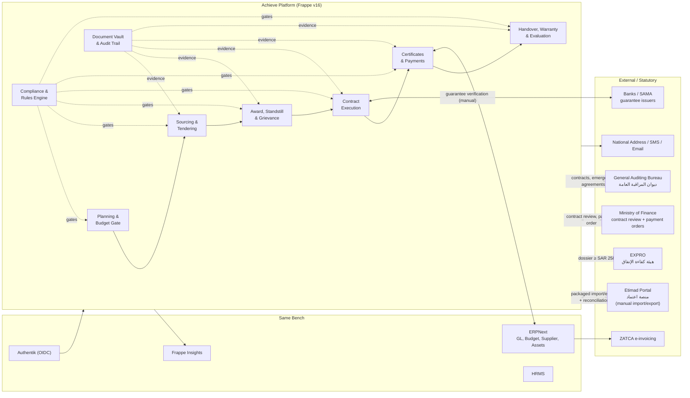
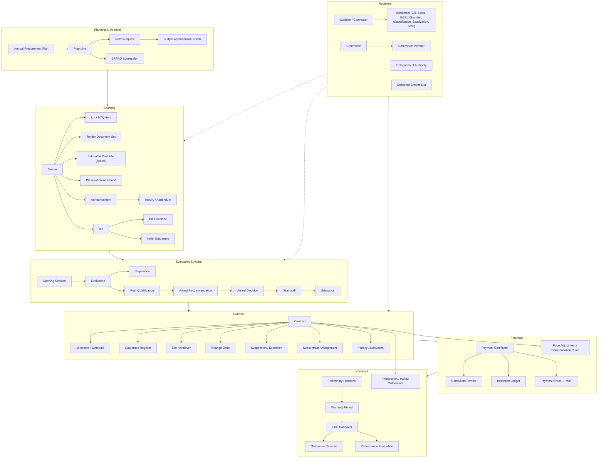
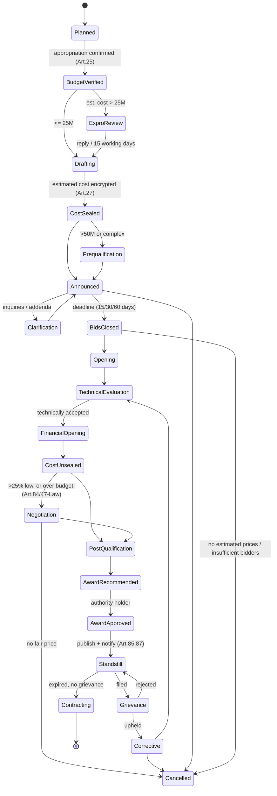
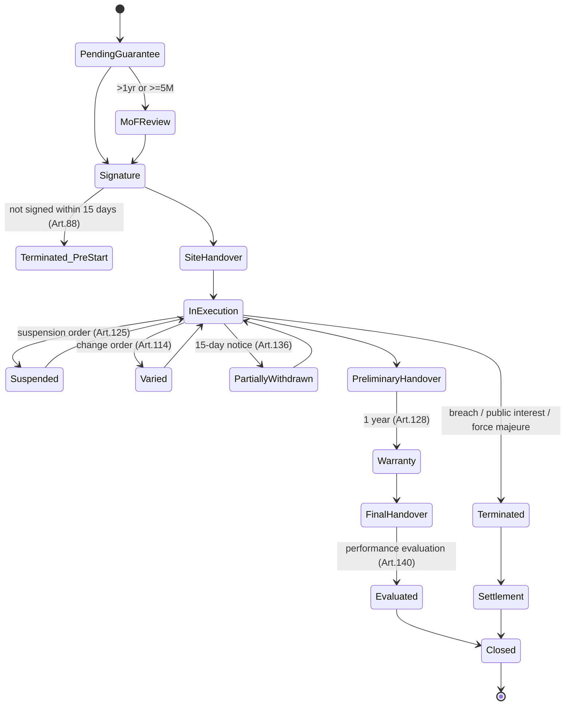
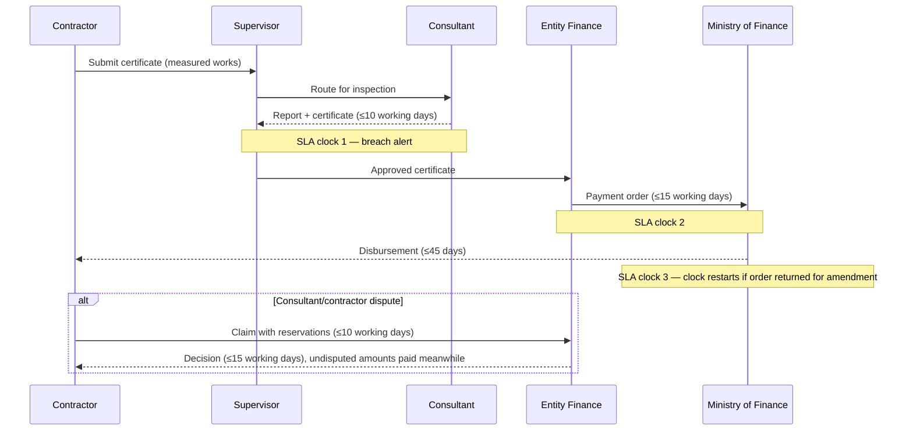

# High Level Design — Government Procurement & Contract Management
### "Achieve" — Beneficiary Entity (الجهة الحكومية) Perspective
**Version:** 0.2 (draft for review)
**Regulatory baseline:** Government Tenders & Procurement Law (Royal Decree M/128, 13/11/1440H) + Executive Regulations (MR 1242 of 21/03/1441H, as amended by MR 3479 of 11/08/1441H, effective 01/09/1441H)
**Process baseline:** `نظام_المنافسات_والمشتريات_الحكومية.json` — process definition `KSA_GTPL_PROCUREMENT_LIFECYCLE` v2.1.0 (6 phases, 16 steps), corroborated by `نظام_المنافسات_والمشتريات_الحكومية.mmd`

> **On the two process inputs:** the JSON is a *coarse* lifecycle skeleton — 16 steps with roles and three SLAs. The MMD adds decision gates (pre-qualification, abnormally-low check, negotiation, grievance branch) that the JSON omits, and the Regulations add roughly 60 further statutory steps that neither input carries (addenda, post-qualification, site handover, suspension, extension, variations, claims, partial withdrawal, termination, disposal). §4.5 binds the JSON as the canonical *phase/step identifiers* and treats the Regulations as the authoritative *sub-step* source, so external references to `STEP_xxx` stay stable while the internal model is complete.
>
> **Still missing:** a machine-readable article/clause index of the Law itself. §4.1 defines the schema for it; until supplied, the Law-derived figures below are marked *verify*.

---

## 1. Purpose & Scope

### 1.1 Purpose
A single system of record for the government entity to plan, tender, award, contract, execute, pay, close out and evaluate procurement — with statutory compliance enforced as data-driven gates rather than tribal knowledge, and with a defensible audit trail for the General Auditing Bureau (ديوان المراقبة العامة), the Expenditure Efficiency & Government Projects Authority (EXPRO), and the Ministry of Finance.

### 1.2 In scope
| # | Capability | Regulatory anchor |
|---|---|---|
| 1 | Annual procurement planning & publication | Law Art. 12; Reg. Art. 3 |
| 2 | Budget appropriation verification before commitment | Reg. Art. 25 |
| 3 | EXPRO pre-tender review dossier & SLA | Reg. Art. 7 |
| 4 | Tender document preparation, specs, BOQ, draft contract | Reg. Art. 21, 24 |
| 5 | Confidential encrypted estimated cost | Reg. Art. 27 |
| 6 | Pre-qualification & post-qualification | Reg. Art. 15–20 |
| 7 | All 8 contracting methods | Reg. Art. 32 |
| 8 | Announcement, inquiries, addenda, bid receipt | Reg. Art. 33–34, 73 |
| 9 | Committees (formation, quorum, conflict rules, 3-yr renewal) | Reg. Art. 20, 47, 71, 74 |
| 10 | Bid opening, examination, correction, negotiation, award | Reg. Art. 72, 74–85 |
| 11 | Standstill period & grievances | Reg. Art. 87, 153 |
| 12 | MoF financial review, contract signature & copies register | Reg. Art. 88, 89, 93 |
| 13 | Guarantees lifecycle (initial, final, advance, cash insurance) | Reg. Art. 70, 100–107 |
| 14 | Execution: site handover, variations, suspension, extension, penalties | Reg. Art. 96, 114–126 |
| 15 | Payment certificates, retention, payment-order SLA | Reg. Art. 108–112 |
| 16 | Preliminary/final handover, warranty, decennial liability | Reg. Art. 127–130, 99 |
| 17 | Termination, partial withdrawal, execution at contractor's expense | Reg. Art. 131–139 |
| 18 | Contractor performance evaluation & debarment referral | Reg. Art. 140 |
| 19 | Sale of movables, rental, equipment replacement | Reg. Art. 141–152 |
| 20 | Disputes: amicable, dispute council, arbitration | Reg. Art. 153–155 |

### 1.3 Out of scope (v1)
- Bidder-facing portal. Etimad remains the statutory publication and bid-receipt channel (Law Art. 16; Reg. Art. 8, 9). Achieve is the **internal back office**, not a competing marketplace.
- Automated Etimad API integration — confirmed manual import/export in this environment.
- Payroll/HR of the contractor's workforce; Zakat/tax assessment (ZATCA is authoritative).
- National security, weapons and military equipment procurement, which is exempted from publication and portal retention (Reg. Art. 3(2), 9(7), 85(4)) — routed to a restricted enclave, flagged only.

### 1.4 Design principles
1. **Regulation as data, not code.** Every threshold, duration and cap is a versioned record with an effective date and an article citation. A ministerial amendment is a data change, not a release.
2. **Gate, don't block silently.** Compliance failures produce a named violation with the article reference and either a hard stop or a justified override captured in the audit trail.
3. **Working days are a first-class type.** Nearly every statutory duration is expressed in *working* days against the Saudi calendar; date arithmetic must never be naive.
4. **Confidentiality by construction.** The estimated cost, bid contents before opening, and inquirer identity are protected at the storage layer, not by UI convention.
5. **Single source of truth for money.** Achieve owns commitments; ERPNext owns the general ledger. No parallel accounting.
6. **Evidence over assertion.** Every state transition stores who, when, under which delegated authority, and against which document.

---

## 2. Actors & Roles

| Actor | Arabic | Responsibilities in system | Key constraint |
|---|---|---|---|
| Authority Holder | صاحب الصلاحية | Approves award, contract, variations, termination, penalties | Delegation matrix with value ceilings |
| Entity Head / Delegate | رئيس الجهة أو من يفوضه | Forms committees, approves award, emergency procurement | Reg. Art. 20, 46(4), 71 |
| Procurement Officer | أخصائي مشتريات | Builds plan, tender docs, runs the process | Cannot sit on examination committee for own tender |
| Beneficiary/Requesting Dept. | الجهة المستفيدة | Raises need, specs, technical acceptance | |
| Cost Estimator | معد التكلفة التقديرية | Prepares estimated prices, seals file | Access revoked after sealing |
| Pre/Post-Qualification Committee | لجنة التأهيل | Qualifies bidders | ≥3 + chair, ≥1 technical; no overlap with other committees; re-formed every 3 yrs (Art. 20) |
| Bid Opening Committee | لجنة فتح العروض | Opens bids, records minutes | ≥3 + chair; re-formed every 3 yrs (Art. 71) |
| Bid Examination Committee | لجنة فحص العروض | Technical/financial evaluation, recommendation | ≥3 + chair incl. financial controller, legal, technical (Art. 74) |
| Direct Purchase Committee | لجنة فحص عروض الشراء المباشر | Examines direct purchase offers | ≥3; no chair/membership overlap (Art. 47) |
| Receipt Committee | لجنة الاستلام | Preliminary/final handover | Art. 127–130 |
| Sale/Auction Committee | لجنة البيع | Valuation and auction of movables | ≥3 specialists (Art. 141, 143) |
| Project Consultant | استشاري المشروع | Reviews payment certificates, extension and compensation reports | 10 working days on certificates (Art. 109(2)) |
| Contract Manager / Supervisor | مشرف التنفيذ | Day-to-day execution, penalties, milestones | |
| Finance / Budget Officer | الشؤون المالية | Appropriation check, payment order to MoF | |
| Legal | الإدارة القانونية | Contract drafting review, grievances, disputes | |
| Internal Audit / Compliance | المراجعة الداخلية | Read-all, override review, exception reporting | Read-only on operational data |
| External observers | ديوان المراقبة، وزارة المالية، هيئة كفاءة الإنفاق | Receive statutory copies/dossiers | Export-only, no write access |
| Contractor | المتعاقد | Submits certificates, claims, correspondence | Via Etimad + controlled correspondence log; no direct system login in v1 |

RBAC is enforced at DocType, field and row (permission-query) level, layered on Authentik groups. Committee membership is a *record-level* grant with an expiry, not a static role.

Each actor carries the role key from the process definition (`Procurement_Officer`, `Head_Of_Agency`, `Bid_Opening_Committee`, `Bid_Examination_Committee`, `Winning_Contractor`, `Financial_Department`, `Inspection_Committee`, `Project_Manager`, `EXPRO_Authority`, `Ministry_Of_Finance`, `Bidder`) so that step assignment resolves from data — see §4.5. `Multi_Party` and `Aggrieved_Bidder / Agency_Grievance_Unit` are composite keys and are decomposed there.

---

## 3. System Context



---

## 4. Compliance, Rules & Process Definition Engine (the core of the design)

This is what distinguishes the product from a generic contract manager. It is a first-class subsystem, not annotations on forms. It has three data-driven layers: the **legal reference** (§4.1), the **rule/threshold catalogue** derived from it (§4.2–4.4), and the **process definition** the two are bound to (§4.5).

### 4.1 Legal reference model

Required schema for the Law article index (and the internal `Legal Article` DocType) — this is the input still outstanding:

```json
{
  "instrument": {
    "code": "GTPL",
    "name_ar": "نظام المنافسات والمشتريات الحكومية",
    "name_en": "Government Tenders and Procurement Law",
    "issued_by": "Royal Decree M/128",
    "issued_date_h": "1440-11-13",
    "effective_date_h": "1441-01-01",
    "version": "2019"
  },
  "articles": [
    {
      "number": 34,
      "chapter_ar": "…",
      "title_ar": "…",
      "text_ar": "…",
      "clauses": [
        { "path": "1.أ", "text_ar": "…", "machine_facts": [
          { "type": "duration", "key": "advertising_period.tier1", "value": 15, "unit": "day",
            "condition": "estimated_cost <= 5000000" }
        ]}
      ],
      "supersedes": null,
      "amended_by": "MR 3479"
    }
  ]
}
```

`machine_facts` is the bridge: it is what seeds `Policy Threshold` records, so each numeric gate in the system traces back to a clause path.

### 4.2 DocTypes

| DocType | Purpose |
|---|---|
| `Legal Instrument` | Law / Regulation / Ministerial decision / Circular, with issue + effective dates |
| `Legal Article` | Article, clause tree, Arabic text, amendment chain |
| `Policy Threshold` | `key`, `value`, `unit`, `currency`, `condition`, `effective_from`, `effective_to`, `article_link` |
| `Compliance Rule` | Applies to DocType + trigger event; expression; severity (`block` / `warn` / `inform`); article link; override policy |
| `Compliance Check` | Immutable result per evaluation: rule, target doc, outcome, evaluated values, timestamp |
| `Compliance Override` | Who overrode, justification, approving authority, attachments |
| `Working Calendar` | Weekends, official holidays, Hijri↔Gregorian mapping, per-year |
| `SLA Clock` | Start event, duration, day-type (working/calendar), pause conditions, breach action |

Rules are evaluated on `validate`, on workflow transition, and on a nightly sweep for time-based rules (expiries, SLA breaches, committee renewal).

### 4.3 Threshold catalogue (seed data — verify before go-live)

**Money thresholds (SAR)**

| Key | Value | Effect | Source |
|---|---|---|---|
| `expro.review_required_above` | 25,000,000 | Mandatory EXPRO review of feasibility, estimated cost, tender & pre-qual docs; Minister may amend | Reg. Art. 7(1) |
| `prequalification.required_above` | 50,000,000 | Pre-qualification for major/complex/high-cost projects | Reg. Art. 15(1) |
| `prequalification.exempt_direct_purchase_upto` | 100,000 | Direct purchase & design contest exempt from Art. 15(1)(2) | Reg. Art. 15(4) |
| `limited_competition.max_value` | 500,000 | Above it (after negotiation fails) → cancel and re-tender as general | Reg. Art. 37 |
| `direct_purchase.committee_exempt_upto` | 30,000 | Below it, no direct-purchase examination committee (excl. additional works) | Reg. Art. 47(2) |
| `reverse_auction.max_tender_cost` | 5,000,000 | Cap for e-reverse auction | Reg. Art. 54(2) |
| `two_envelope.mandatory_at_or_above` | 5,000,000 | Two encrypted files (technical + financial); optional below | Reg. Art. 60 |
| `mof_review.value_at_or_above` | 5,000,000 | MoF financial review before signing (or term > 1 year) | Reg. Art. 93(1) |
| `results_publication.above` | 100,000 | Publish tender results & contract data within 30 days of contracting | Reg. Art. 85(3) |
| `arbitration.allowed_above` | 100,000,000 | Arbitration clause permitted; Minister may amend | Reg. Art. 154(1) |

**Percentages**

| Key | Value | Effect | Source |
|---|---|---|---|
| `guarantee.initial.shortfall_tolerance` | 10% | Accept shortfall; complete within 10 working days | Reg. Art. 70(1) |
| `guarantee.final.default` | 5% | Final guarantee; may be raised with prior Minister approval | Law Art. 61; Reg. Art. 100 |
| `advance_payment.max` | 10% of contract value | Against equal advance-payment guarantee | Reg. Art. 108, 102 |
| `retention.per_certificate.max` | 10% | Retention per payment certificate | Reg. Art. 111(1) |
| `final_certificate.min` | 10% construction / 5% others | Held to final invoice | Reg. Art. 111(2) |
| `bid.abnormally_low` | ≥25% below estimated cost | Mandatory discussion + capability review | Reg. Art. 84 |
| `bid.pricing_deviation.exclusion` | >10% | Amended/erased price cells or arithmetic error beyond 10% → may exclude | Reg. Art. 69(4), 81(3) |
| `variation.increase.max` | 10% of contract value | Increase of contractor obligations | Law Art. 69 *(verify)* |
| `variation.decrease.max` | 20% of contract value | Decrease of contractor obligations | Law Art. 69 *(verify)* |
| `continuous_services.extension.max` | 10% of total contract value | As additional works, if not already consumed | Reg. Art. 116 |
| `subcontracting.max_without_expro` | 30% of contract value | With entity prior approval | Reg. Art. 118(1)(d) |
| `subcontracting.max_with_expro` | 50% of contract value | 30–50% needs EXPRO + entity prior approval, multiple subcontractors | Reg. Art. 118(2) |
| `delay_penalty.cap` | 20% of value of delayed works | Public construction, partial-use case | Reg. Art. 122 |
| `compensation.cap` | 20% of total contract value | Above it → Administrative Court | Reg. Art. 113(III)(5) |
| `consultant_supervision_fee.max` | 3% of construction contract value | Percentage or lump sum | Reg. Art. 95(6) |
| `auction.reprice_trigger` | >10% below estimate | Re-advertise after re-valuation | Reg. Art. 144 |
| `broker.commission.max` | 2.5% of sales value | Public auction intermediaries | Reg. Art. 149 |
| `performance.termination_threshold` | <70% three consecutive evaluations | Termination / debarment referral | Reg. Art. 92(2), 140(5) |

**Durations** (⚙ = working days)

| Key | Value | Trigger → deadline | Source |
|---|---|---|---|
| `plan.publication_window` | Q1 of fiscal year | Publish annual plan | Reg. Art. 3(1) |
| `expro.response` | 15 ⚙ | From dossier receipt | Reg. Art. 7(2) |
| `advertising.tier1` | 15 days | Estimated cost ≤ 5M | Reg. Art. 34(1)(a) |
| `advertising.tier2` | 30 days | >5M and <100M | Reg. Art. 34(1)(b) |
| `advertising.tier3` | 60 days | ≥100M | Reg. Art. 34(1)(c) |
| `limited_competition.notice` | 20 days | Verify absence of other suppliers | Reg. Art. 36(1) |
| `direct_purchase.sole_source_notice` | 10 ⚙ | Verify single supplier | Reg. Art. 44(2) |
| `reverse_auction.registration` | ≥15 days | Announcement → registration close | Reg. Art. 55(2) |
| `retender.continuous_services` | ≥1 year before expiry | Re-tender ongoing services | Reg. Art. 35 |
| `portal_outage.max` | 3 consecutive days | Beyond it → paper fallback permitted | Reg. Art. 8(III)(IV) |
| `initial_guarantee.validity` | ≥90 days from opening | Shortfall ≤30 days curable | Reg. Art. 70(2) |
| `initial_guarantee.completion` | 10 ⚙ | Cure shortfall or deemed withdrawn | Reg. Art. 70(1) |
| `certificates.missing_docs` | ≤10 ⚙ | Complete or exclude + confiscate | Reg. Art. 77 |
| `bid_validity.extension` | ≤90 days | Request; bidder replies in 2 weeks | Reg. Art. 67 |
| `standstill` | 5–10 ⚙ | From award decision; no grievance after | Reg. Art. 87(1)(4) |
| `grievance_guarantee.validity` | ≥30 days | From grievance filing | Reg. Art. 153(3) |
| `contract.signature` | 15 days from notice | Else terminate + confiscate final guarantee | Reg. Art. 88(1) |
| `mof.contract_review` | Prior to signature | Term >1yr or ≥5M | Reg. Art. 93(1) |
| `site.handover` | 60 days | From contract (Law Art. 59(2)); +30 days notice → termination right | Reg. Art. 96, 133(1) |
| `site.receipt_by_contractor` | 15 days from notice | Else deemed delivered | Reg. Art. 97(1) |
| `certificate.consultant_review` | 10 ⚙ | Receipt → report | Reg. Art. 109(2) |
| `certificate.entity_payment_order` | 15 ⚙ | Report/certificate → payment order | Reg. Art. 109(3) |
| `mof.payment` | 45 days | Payment order → disbursement | Reg. Art. 109(4) |
| `claim.filing` | 60 days from event | Compensation claim | Reg. Art. 113(III)(1) |
| `claim.consultant_study` | 21 days | Complete claim → report | Reg. Art. 113(III)(2) |
| `claim.entity_study` | 45 days | Report → examination committee | Reg. Art. 113(III)(3) |
| `claim.committee_decision` | 45 days | Complete claim → decision | Reg. Art. 113(III)(4) |
| `extension.consultant_report` | 21 days | Request → technical report | Reg. Art. 126(1) |
| `extension.committee` | 30 days | Study + recommendation | Reg. Art. 126(2) |
| `extension.contractor_notice` | 7 days | Approval → notify + revised schedule | Reg. Art. 126(3) |
| `suspension.compensation_ratio` | 2 days per 3 days | Total compensation ≤45 days | Reg. Art. 125(3) |
| `receipt.committee_formation` | 15 days | From completion notice | Reg. Art. 127(2) |
| `warranty.construction` | 1 year from preliminary handover | Maintenance & defects | Reg. Art. 128(1) |
| `decennial_liability` | 10 years | Total/partial collapse | Reg. Art. 99(1) |
| `continuous_services.receipt_committee` | 30 days before contract end | Inspect & receive | Reg. Art. 129(1) |
| `partial_withdrawal.notice` | 15 days | Remedy or execute at his expense | Reg. Art. 136(1) |
| `termination.public_interest` | 30 days from notification | Effective | Reg. Art. 132 |
| `dispute_council.decision` | 30 days | From receipt of report & documents | Reg. Art. 155(5) |
| `dispute_council.objection` | 15 days | Re-decision, then final | Reg. Art. 155(6) |
| `auction.award_decision` | 30 days | From envelope opening; else bidder may withdraw | Reg. Art. 146 |
| `auction.payment` | 10 days from award notice; 15 days after warning | Else confiscate | Reg. Art. 147 |
| `auction.collection` | 15 days from payment | Else storage fees | Reg. Art. 148 |
| `results_publication` | ≤30 days from contracting | Publish contract data | Reg. Art. 85(3) |
| `committee.reformation` | Every 3 years | Pre-qual, opening, examination committees | Reg. Art. 20(4), 71(3), 74 |

### 4.4 Structural (non-numeric) rules — sample

| Rule | Severity | Source |
|---|---|---|
| No person may chair or sit on more than one of the qualification / opening / examination / direct-purchase committees for the same tender | block | Art. 20(2), 47(1) |
| Estimated cost file must exist and be sealed before announcement; tender is void without estimated prices | block | Art. 27(1)(j), 27(3) |
| Specifications must not name a brand or a supplier-list line number | block | Art. 24(1)(2) |
| Any amendment to documents must be broadcast to **all** registered bidders | block | Art. 1(3) |
| No amendment to conditions/specs/BOQ after bid submission → else tender cancelled | block | Art. 1(4) |
| No commitment without confirmed appropriation (unless urgency clause is stated in the documents) | block + override | Art. 25(1)(2) |
| Award notice must state no legal/financial obligation arises before all parties sign | block | Art. 25(4) |
| Award decision not effective until standstill ends and grievances are resolved | block | Art. 87(5) |
| Work may not start before contract signature | block | Art. 88(2) |
| Additional works only after the entity has received the contracted works → not allowed | block | Art. 114(5) |
| Guarantee confiscation limited to the guarantee of the breached operation only | block | Art. 104(2) |
| Contract splitting must not be a device to switch procurement method | block | Art. 30(1) |
| Bidder may not submit both an individual bid and a joint-venture bid | block | Art. 31(I)(7) |
| Contracts and documents must be Arabic; foreign language allowed only with certified Arabic translation and defined governing language | warn | Reg. Art. 5(2) |

### 4.5 Process definition binding

`KSA_GTPL_PROCUREMENT_LIFECYCLE` v2.1.0 is loaded as data, not hard-coded, into three DocTypes:

| DocType | Purpose |
|---|---|
| `Process Definition` | `processDefinitionKey`, `version`, governing law link, activation date. Multiple versions coexist; a tender is pinned to the version active at announcement, so an in-flight tender is never re-scoped by a definition upgrade. |
| `Process Phase` | `phaseId`, `order`, bilingual name |
| `Process Step` | `stepId`, phase, bilingual name, `role`, `slaWorkingDays`, `condition` (field/operator/value/currency), `notes`, plus Achieve-side extensions: `target_doctype`, `entry_state`, `exit_state`, `mandatory`, `evidence_required[]`, `article_links[]`, `substeps[]` |

The JSON `condition` object maps directly onto `Policy Threshold`: `STEP_102_EXPRO_REVIEW`'s `tender.estimatedCost > 25000000 SAR` **is** `expro.review_required_above`, and `slaWorkingDays: 15` **is** `expro.response`. The two representations are reconciled at load time; a mismatch between the process definition and the threshold catalogue is itself a compliance violation surfaced to the administrator, not silently resolved.

**Step → artefact mapping and statutory expansion**

| stepId | JSON role | Achieve artefact / state | Statutory sub-steps added by Achieve |
|---|---|---|---|
| `STEP_101_ANNUAL_PLAN` | Procurement_Officer | `Annual Procurement Plan` → Published | Minimum plan contents (type, location, method); national-security exclusion; continuous updating (Art. 3) |
| `STEP_102_EXPRO_REVIEW` | EXPRO_Authority | `EXPRO Submission` + SLA clock | Dossier composition: feasibility study, estimated cost, tender docs, pre-qual docs, procedures taken (Art. 7(1)) |
| — | — | `Budget Appropriation Check` | **Missing from JSON.** Mandatory before commitment (Art. 25) |
| `STEP_201_METHOD_SELECTION` | — | `Tender.method` via decision service (§6.4) | All 8 methods, per-method preconditions, urgency vs. emergency separation (Art. 32, 38, 46) |
| — | — | `Tender Document Set`, `Estimated Cost File` (sealed) | **Missing from JSON.** Art. 21, 24, 27 — the sealed cost file is the single highest-risk control in the process |
| — | — | `Prequalification Round` | **Missing from JSON.** Art. 15–20; mandatory >SAR 50M or complex |
| `STEP_202_PORTAL_PUBLICATION` | Procurement_Officer | `Announcement` + `Etimad Interchange` | Tiered advertising window 15/30/60 days; minimum announcement contents; outside-Kingdom publication (Art. 33, 34) |
| — | — | `Inquiry`, `Addendum` | **Missing from JSON.** Broadcast to all bidders, questioner masked (Art. 1(3), 9(5)) |
| `STEP_301_BID_SUBMISSION` | Bidder | `Bid`, `Bid Envelope`, `Initial Guarantee` | Two-envelope rule ≥SAR 5M; guarantee shortfall cure; paper fallback on portal outage (Art. 60, 65, 70) |
| `STEP_302_BID_OPENING` | Bid_Opening_Committee | `Opening Session` + minutes | Committee composition, sequential numbering, referral deadline to examination committee (Art. 71, 72) |
| `STEP_303_BID_EXAMINATION` | Bid_Examination_Committee | `Evaluation` | Arithmetic correction rules, >10% exclusion, ≥25% abnormally-low discussion, tie-break order, financial envelope opening, cost-file unseal (Art. 78–84) |
| — | — | `Negotiation`, `Post-Qualification` | **Missing from JSON.** Art. 16, 83, 84 |
| `STEP_401_AWARD_ANNOUNCEMENT` | Head_Of_Agency | `Award Recommendation` → `Award Decision` → published | Authority-holder approval, minimum notice contents, notification of unsuccessful bidders with technical scores (Art. 85) |
| `STEP_402_STANDSTILL_PERIOD` | Aggrieved_Bidder / Agency_Grievance_Unit | `Standstill` (5–10 ⚙) + `Grievance` | Grievance guarantee ≥30 days validity; award not effective until standstill closes; no grievance accepted after expiry (Art. 87, 153) |
| `STEP_501_FINAL_GUARANTEE` | Winning_Contractor | `Guarantee` (final, 5%) | Bank eligibility, unconditional + first-demand terms, verification with issuing bank, extension automation (Art. 100, 103, 105) |
| `STEP_502_MOF_CONTRACT_REVIEW` | Ministry_Of_Finance | `MoF Review` + SLA clock | Trigger is term >1 year **or** value ≥SAR 5M; internal legal/drafting review precedes it (Art. 93) — see discrepancy D2 |
| `STEP_503_SIGN_CONTRACT` | Head_Of_Agency | `Contract` → Signed, `copies_register[]` | 15-day signature deadline with termination + guarantee confiscation; 6 statutory copies incl. GAB; no work before signature (Art. 88, 89) |
| — | — | `Site Handover` | **Missing from JSON.** 60-day delivery, deemed-delivery at 15 days, termination right (Art. 96, 97, 133) |
| `STEP_504_INVOICING_PIPELINE` | Multi_Party | `Payment Certificate` → SLA chain (§6.3) | Consultant 10⚙ / entity 15⚙ / MoF 45d; retention ≤10%; penalties and deductions; dispute carve-out (Art. 109, 111) |
| — | — | `Change Order`, `Suspension`, `Extension`, `Claim`, `Subcontract`, `Assignment`, `Partial Withdrawal`, `Termination` | **Missing from JSON.** The entire execution-control surface: Art. 113–126, 131–139 |
| `STEP_601_FINAL_INVOICE_DISBURSEMENT` | Financial_Department | Final `Payment Certificate` | Certificate set: completion, ZATCA, GOSI, contract-model certificates; ≥10% construction / 5% other held to final invoice (Art. 111(2)) |
| `STEP_602_WARRANTY_AND_FINAL_ACCEPTANCE` | Inspection_Committee | `Preliminary Handover` → `Warranty` → `Final Handover` → `Guarantee Release` | Receipt committee within 15 days; 1-year maintenance warranty; 10-year decennial liability; continuous-services receipt 30 days before end (Art. 99, 127–129) |
| `STEP_603_CONTRACTOR_PERFORMANCE_EVAL` | Project_Manager | `Contractor Performance Evaluation` | EXPRO template compliance; periodic *and* final evaluation; <70% × 3 consecutive → debarment referral (Art. 92, 140) |
| — | — | `Movable Sale`, `Auction`, `Rental`, `Equipment Replacement` | **Missing from JSON.** Book 5: Art. 141–152 |

Roles in the JSON are treated as the canonical role keys and mapped 1:1 onto Authentik groups; `Multi_Party` is expanded into the concrete participants of the Art. 109 chain, and `Aggrieved_Bidder / Agency_Grievance_Unit` is split into an external party (no login) and an internal unit.

### 4.6 Discrepancy register — process inputs vs. Regulations

Carried as open items; each needs a legal ruling before the corresponding rule is seeded.

| # | Discrepancy | Position taken in this design |
|---|---|---|
| D1 | JSON `STEP_102` conditions EXPRO review on estimated cost alone; Art. 7(1) also lists documents and *procedures already taken* as reviewable content | Threshold governs the trigger; dossier completeness is a separate `block` rule |
| D2 | JSON sets `slaWorkingDays: 15` for MoF contract review; the Regulations set no explicit SLA for Art. 93 review (the 15-working-day figure appears in Art. 7(2) for EXPRO) | Modelled as an internal service-level target, not a statutory deadline — breach warns, never blocks |
| D3 | JSON `STEP_504` implies payment certificates are certified *via Etimad*; the environment is confirmed manual import/export | Certificates are owned by Achieve; Etimad exchange is a recorded interchange package. Revisit if the entity is mandated onto Etimad's invoicing module |
| D4 | JSON `STEP_301` cites Monsha'at integration for SME verification; no such integration exists in this environment | SME status is a credential record with an expiry, evidenced by the Monsha'at certificate, verified manually (Art. 13(1)(h)) |
| D5 | JSON names the audit body "GCA"; the Regulations use ديوان المراقبة العامة (General Auditing Bureau) | Single entity; canonical name GAB, alias GCA retained for external references |
| D6 | JSON has no cancellation, re-tender or failed-competition path; Regulations require several (Art. 27(3), 37, 54(7), 86) | Cancellation is a terminal transition available from most tender states, with fee-refund rules (Art. 86) |
| D7 | MMD gates on "> SAR 50M **or** complex" for pre-qualification; Art. 15(1) reads major *or* complex *or* high-cost projects exceeding SAR 50M | Rule expressed as `is_major OR is_complex OR estimated_cost > 50M`, with the qualitative flags requiring recorded justification |

---

## 5. Domain Model

### 5.1 Bounded contexts



### 5.2 Key entities (selected fields)

**Tender (منافسة)**
`tender_no`, `title_ar/en`, `plan_line`, `method` (8 values), `type` (goods/works/services/consulting/IT), `lots[]`, `estimated_cost` *(computed, not exposed)*, `estimated_cost_file`, `classification_field`, `local_content_required`, `smes_priority`, `two_envelope` (derived from threshold), `advertising_days` (derived), `announcement_date`, `bid_deadline`, `bid_validity_days`, `initial_guarantee_pct`, `documents_fee`, `prequalification_round`, `committees[]`, `status`, `cancellation_reason`, `etimad_ref`.

**Estimated Cost File** — `tender`, `ciphertext` (AES-GCM), `key_ref` (KMS/HSM handle), `sealed_by`, `sealed_on`, `custodian` (examination committee chair), `unsealed_by`, `unsealed_on`, `unseal_witnesses[]`. No plaintext field exists anywhere in the schema. Unsealing requires two-person authorisation and is only permitted after the financial envelopes have been opened (Art. 27(1)(j), 78).

**Bid (عرض)** — `tender`, `bidder`, `submission_channel` (portal/sealed envelope/hand delivery per Art. 65), `received_on`, `sequential_no` (Art. 72(4)), `envelopes[]`, `initial_guarantee`, `alternative_offer` (allowed only if documents permit — Art. 63), `credentials_snapshot[]`, `arithmetic_corrections[]`, `exclusion_reason`, `technical_score`, `financial_score`, `rank`.

**Contract (عقد)** — `contract_no`, `tender`/`direct_purchase`, `contractor`, `type` (11 types, Art. 94), `pricing_pattern` (7 patterns, Art. 95), `value`, `currency`, `start_date`, `duration`, `end_date`, `copies_register[]` (6 minimum, Art. 89(1)), `mof_review`, `final_guarantee`, `advance_payment`, `retention_policy`, `delay_penalty_formula`, `performance_criteria`, `warranty_terms`, `arbitration_clause`, `status`.

**Guarantee** — `type` (initial/final/advance/cash insurance/grievance), `party`, `issuing_bank`, `foreign_bank_confirmed_by` (Art. 105(1)(2)), `amount`, `pct_of`, `issue_date`, `expiry`, `unconditional` (must be true — Art. 105(6)), `payable_on_first_demand` (must be true — Art. 105(5)), `extension_requests[]`, `release_date`, `confiscation` (link to decision). Nightly job raises extension requests before expiry (Art. 103).

**Payment Certificate (مستخلص)** — `contract`, `period`, `works_executed[]` (measured against BOQ), `consultant_report`, `retention_amount`, `penalties[]`, `deductions[]`, `net_payable`, `submitted_on`, `consultant_due` / `entity_due` / `mof_due` (SLA clocks), `payment_order_ref`, `paid_on`, `zatca_invoice_ref`.

**Contractor Credential** — typed certificate register with expiry monitoring: CR / licence, Zakat & Tax, GOSI, Chamber of Commerce, Classification (with field & grade), Saudi Contractors Authority, Saudi Council of Engineers, SME certificate, Saudization ratio certificate (Art. 13(1)). Validity is checked **at bid opening** (Art. 13(2)) and again at each payment certificate (Art. 111(2)).

---

## 6. Process Design

### 6.1 Tender state machine



### 6.2 Contract state machine



### 6.3 Sequence — payment certificate SLA chain (Art. 109)



### 6.4 Method-selection decision service

A single service resolves the permitted contracting method from: estimated value, nature of works, market structure (sole source / limited suppliers), urgency, recurrence, and whether a framework agreement covers the need. It returns the method, the mandatory pre-conditions (e.g. 10-working-day sole-source notice for direct purchase), and the article citations, and it records the justification. Emergency (طارئة) and urgent (عاجلة) are distinct paths with distinct evidence requirements (Art. 38, 46); the system rejects "urgency" that arises from the entity's own delay (Art. 38(2)).

---

## 7. Integration Architecture

| Integration | Direction | Mode (v1) | Design notes |
|---|---|---|---|
| **Etimad** | bi-directional | Manual export/import packages | An `Etimad Interchange` DocType wraps every exchange: package type (plan, announcement, addendum, bid register, award, contract data, performance evaluation), payload file, exported_by, uploaded_on, portal reference, reconciliation status. A reconciliation report flags Achieve records that have no portal reference and portal references with no local record. Designed so a future API adapter replaces only the transport, not the model. |
| **Authentik** | inbound | OIDC SSO | Groups → Achieve roles; committee membership stays local (record-scoped, time-boxed). MFA enforced for authority holders and cost-file custodians. |
| **ERPNext** | bi-directional | Same bench, native links | Appropriation check against Budget; commitment postings; Supplier master shared; Purchase Order/Receipt for supply contracts; Asset creation on handover. Achieve never writes journal entries directly. |
| **Ministry of Finance** | outbound | Structured export | Contract review dossier (>1yr or ≥5M) and payment orders; SLA clocks track the 45-day disbursement. |
| **EXPRO** | outbound | Dossier export | Feasibility study, estimated cost, tender + pre-qual documents, procedures taken; 15-working-day clock. |
| **General Auditing Bureau** | outbound | Export | All emergency-case agreements, contracts and disbursement documents (Art. 46(5)); one of the six contract copies (Art. 89(1)). |
| **ZATCA** | outbound | via ERPNext KSA e-invoicing | Contractor invoices matched to certificates. |
| **Banks / SAMA** | inbound | Manual verification + document upload | Guarantee authenticity verification is mandatory on receipt (Art. 105(3)); recorded as a check, not assumed. Issuer must be SAMA-licensed, or a foreign bank confirmed by a local bank (Art. 105(1)(2)). |
| **Monsha'at** | inbound | Certificate upload + expiry tracking (manual, per D4) | SME status drives tie-break priority (Art. 80) and local-content preference; stored as a dated credential, never inferred. |
| **GOSI** | inbound | Certificate verification at bid opening and at final certificate | Art. 13(1)(c), 111(2)(c). |
| **Notification channels** | outbound | Email / SMS / national address | Legal effect from issue date (Art. 90(2)); every notification is logged with delivery evidence. |
| **Frappe Insights** | outbound | Read replica / query | Dashboards in §9. |

---

## 8. Security, Confidentiality & Auditability

**Confidentiality controls**
- *Estimated cost:* envelope encryption (AES-GCM, key in HSM/KMS). Ciphertext stored; plaintext exists only in memory during authorised unseal. Unseal requires dual authorisation, is only enabled after financial envelope opening, and emits a tamper-evident event. Pre-announcement disclosure of any tender information by staff or consultants is prohibited (Art. 1(2)); the system therefore restricts tender documents to a named preparation team until announcement.
- *Bids:* sealed until the opening session; contents not readable by evaluators before the opening minutes are recorded.
- *Inquirer identity:* inquiries are published to all bidders with the questioner masked (Art. 9(5)); identity is stored but access-controlled.
- *National-security procurement:* segregated site/company with restricted role set, excluded from publication and portal retention jobs (Art. 3(2), 9(7)).

**Integrity & audit**
- Append-only `Audit Event` stream (actor, role, delegated authority reference, IP, before/after, document hash) — hash-chained, exportable for GAB.
- Committee minutes, opening records and evaluation sheets are versioned, digitally signed, and locked on submission; corrections are new versions with reason, never in-place edits.
- Every workflow transition stores the `Compliance Check` set that permitted it.

**Access**
- Segregation of duties enforced by rule, not convention: preparer ≠ approver; cost estimator loses read access on sealing; committee members cannot serve on conflicting committees.
- Delegation of authority is a dated record with value ceilings; expired delegations block approval.

**Data protection & residency**
- PDPL-aligned; data resident in KSA. Retention: contract and tender file retained ≥10 years after final handover to cover decennial liability (Art. 99), with legal-hold override for disputes.

---

## 9. Reporting & KPIs

| Dashboard | Contents |
|---|---|
| **Pipeline** | Plan vs. actual by quarter, method mix, value at each stage, cycle time per phase |
| **Compliance** | Open violations by article, overrides by approver, committee renewal due, credential expiries, guarantee expiries |
| **SLA** | EXPRO 15d, consultant 10d, entity 15d, MoF 45d, claim 21/45/45d, extension 21/30/7d — with breach ageing |
| **Contract health** | % complete vs. schedule, variation consumption against 10%/20% caps, penalty accrual against 20% cap, retention balances, suspension days against 45-day compensation cap |
| **Supplier** | Performance scores, <70% streaks approaching debarment referral, subcontracting ratios, local content & SME share |
| **Spend** | Commitments vs. appropriation, forecast cash flow of annual contract instalments (Art. 25(3)) |
| **Statutory** | Publication compliance (results within 30 days for >100k), direct-purchase annual disclosure (Art. 48(2)), emergency-case register for GAB |

Built on Frappe Insights over a read model; nothing computed in dashboards that is not reproducible from the audit trail.

---

## 10. Technology & Deployment

| Layer | Choice | Rationale |
|---|---|---|
| Application | Custom Frappe v16 app `achieve`, module `Procurement & Contracts` | Installable alongside ERPNext/HRMS on the existing bench; reuses permissions, workflow, versioning, print formats, background jobs |
| Data | MariaDB (Frappe standard) | Native to the stack |
| Search | Frappe full-text + optional OpenSearch for document corpus | Arabic analyzer required |
| Files | Frappe File + object storage backend, server-side encryption | Large drawings/BOQs |
| Jobs | Frappe scheduler + RQ workers: SLA sweeps, expiry alerts, publication reminders, calendar recalculation | |
| Identity | Authentik OIDC | Existing IdP |
| Analytics | Frappe Insights | Existing decision |
| Rules | Data-driven `Compliance Rule` with sandboxed expression evaluation (safe subset, no arbitrary exec) | Amendments without deployment |
| i18n | Arabic-first, RTL primary, English secondary; dual Hijri/Gregorian date fields on every statutory date | Regulations are Arabic-authoritative (Art. 5(2)) |
| Environments | dev → staging (with anonymised data) → production; blue/green via bench site clone | |
| Backup/DR | Nightly full + binlog; RPO ≤15 min, RTO ≤4 h | Contract file is legally significant |

**Non-functional targets**
- 200 concurrent internal users; tender file with 500 BOQ lines and 30 bids evaluates in <5 s.
- 99.5% business-hours availability; portal outage of the *external* Etimad platform must never block internal work (paper fallback path per Art. 8(IV), 22, 65 is a first-class workflow, not an exception).
- Full bilingual print formats for minutes, contracts, notices, and committee decisions matching MoF templates.

---

## 11. Delivery Roadmap

| Phase | Scope | Exit criteria |
|---|---|---|
| **0 — Foundation** (4–6 wks) | Legal reference + threshold + calendar + rules engine; RBAC; audit trail; Authentik SSO; supplier & credential register; Excel migration of current projects/contracts | Rules engine evaluates seeded thresholds with article traceability; legacy data reconciled |
| **1 — Contract Execution** (6–8 wks) | Contract, guarantees, milestones, change orders, suspension/extension, penalties, payment certificates + SLA chain, ERPNext budget/GL links | Live contracts managed end-to-end; MoF payment orders generated from the system |
| **2 — Sourcing & Award** (8–10 wks) | Planning, EXPRO dossier, tender documents, sealed estimated cost, committees, announcement, bids, opening, evaluation, award, standstill, grievances, Etimad interchange | A full general competition run in parallel with the manual process, matched artefact-for-artefact |
| **3 — Closeout & Performance** (4–6 wks) | Handover, warranty, final guarantee release, performance evaluation, termination/partial withdrawal, dispute council | Closeout of at least one completed contract; evaluations exported to Etimad |
| **4 — Extended** (4–6 wks) | Movable sales & auctions, rental, equipment replacement, framework agreements & call-offs, reverse auction support | Asset-disposal cycle executed |
| **5 — Analytics & Optimisation** | Insights dashboards, forecast cash flow, supplier analytics, API-ready Etimad adapter | KPI pack signed off by leadership |

---

## 12. Risks, Assumptions, Open Questions

**Risks**
| Risk | Impact | Mitigation |
|---|---|---|
| Thresholds/articles drift after amendment | Illegal decisions | Effective-dated rules + quarterly legal review + amendment changelog surfaced in-app |
| Manual Etimad exchange causes divergence | Portal and system disagree; audit finding | Mandatory reconciliation report; no award transition without portal reference recorded |
| Working-day arithmetic errors (Hijri holidays) | Blown statutory deadlines | Single calendar service; annual holiday load with approval; no local date math |
| Estimated-cost leakage | Tender cancellation, liability | HSM key custody, dual-control unseal, no plaintext at rest, access anomaly alerting |
| Committee-overlap violations from small teams | Award challengeable | Hard block + escalation path documented with entity head |
| Over-configuration turning into a rules maze | Unmaintainable | Rules limited to declarative expressions with a test harness; every rule requires a test case |

**Assumptions**
1. Etimad remains the statutory publication and bid-receipt channel; Achieve is not a bidder-facing system.
2. Manual import/export is acceptable for v1; the interchange model is API-ready.
3. ERPNext is the ledger of record; Achieve holds commitments and contract obligations.
4. Arabic is the authoritative language for all contractual artefacts.
5. RCSP's aviation contracts (aircraft management, operations, ground handling, fuel) are continuous-service contracts under Art. 94(2) with performance-based conditions under Art. 92 — the performance-evaluation model must support monthly SLA-linked scoring.

**Open questions for you**
1. Resolve discrepancies D2 (MoF review SLA), D3 (whether payment certification runs through Etimad) and D4 (Monsha'at) in §4.6 — D3 in particular changes the shape of the financial module.
2. Supply the Law's article index in the §4.1 schema, or confirm it should be extracted from the PDF. The process definition is now in hand; the legal reference layer is not.
3. Confirm Law Art. 69 variation limits (increase 10% / decrease 20%) and Art. 58 initial guarantee band (1–2%) — these come from the Law, which was not in the uploaded set.
4. Does the entity delegate any authority thresholds internally (e.g. deputy approves up to SAR X)? Needed to seed the delegation matrix.
5. Is there an in-house project consultant for RCSP contracts, or does the supervisor perform the consultant's statutory review role (affects the Art. 109 SLA chain)?
6. Which of the 8 contracting methods does RCSP actually use today? Phase 2 scope can be trimmed if reverse auction and design contest are never used.
7. Confirm whether any RCSP procurement falls under the national-security exemption, which requires the segregated enclave in §8.
