# خريطة العمليات — نظام المنافسات والمشتريات الحكومية
# Process Atlas — Government Tenders & Procurement Law
### من منظور الجهة الحكومية المستفيدة | From the Beneficiary Government Entity's Perspective

**المرجع النظامي | Legal basis:** المرسوم الملكي م/128 بتاريخ 1440/11/13هـ · اللائحة التنفيذية بالقرار الوزاري 1242 المعدلة بالقرار 3479
**المرجع الإجرائي | Process basis:** `KSA_GTPL_PROCUREMENT_LIFECYCLE` v2.1.0
**ملحق | Companion to:** `Achieve-Procurement-Contract-Management-HLD.md` v0.2 · `Appendix-A-Document-Register.md`

---

## كيف تقرأ هذه الخريطة | How to read this atlas

مخطط واحد لا يستوعب النظام كاملاً بصورة مقروءة. الخريطة نموذج واحد موزّع على 14 مخططاً هرمياً، تتشارك المعرّفات نفسها، فيقرأها المستخدم كوحدة واحدة قابلة للتكبير.

A single rendered graph cannot hold the whole Law legibly. This is **one model decomposed across 14 linked diagrams** that share node identifiers, so it reads as a single zoomable model.

### الرموز | Notation

| الشكل / Shape | المعنى / Meaning |
|---|---|
| `([ ])` | جهة أو دور — Stakeholder / role |
| `[ ]` | إجراء — Process activity |
| `[[ ]]` | عملية فرعية لها مخطط مستقل — Sub-process with its own diagram |
| `{ }` | قرار — Decision |
| `{{ }}` | بوابة نظامية إلزامية — Mandatory statutory gate |
| `[/ /]` | وثيقة تُنتَج أو تُستلَم — Document generated or obtained |
| `(( ))` | مدة نظامية — Statutory clock |

### رموز الجهات | Role codes

| الرمز | العربية | English |
|---|---|---|
| `HOA` | رئيس الجهة الحكومية أو من يفوضه | Head of Agency / Authority Holder |
| `PO` | أخصائي المشتريات | Procurement Officer |
| `BEN` | الجهة المستفيدة الطالبة | Beneficiary / Requesting Dept. |
| `CE` | معد التكلفة التقديرية | Cost Estimator |
| `FIN` | الإدارة المالية | Financial Department |
| `LEG` | الإدارة القانونية | Legal Department |
| `QC` | لجنة التأهيل | Qualification Committee |
| `BOC` | لجنة فتح العروض | Bid Opening Committee |
| `BEC` | لجنة فحص العروض | Bid Examination Committee |
| `DPC` | لجنة فحص عروض الشراء المباشر | Direct Purchase Committee |
| `RC` | لجنة الاستلام | Receipt / Inspection Committee |
| `SC` | لجنة البيع والمزايدة | Sale & Auction Committee |
| `SUP` | مشرف التنفيذ | Contract Supervisor |
| `CSL` | الاستشاري | Project Consultant |
| `CTR` | المتعاقد | Contractor |
| `BID` | المتنافس | Bidder |
| `MOF` | وزارة المالية | Ministry of Finance |
| `EXP` | مركز تحقيق كفاءة الإنفاق | EXPRO |
| `GAB` | ديوان المراقبة العامة | General Auditing Bureau |
| `ZAT` | هيئة الزكاة والضريبة والجمارك | ZATCA |
| `ETM` | منصة اعتماد | Etimad Portal |

`م 34 ل` = المادة 34 من اللائحة التنفيذية · `م 45 ن` = المادة 45 من النظام
`Art.34 R` = Executive Regulations · `Art.45 L` = the Law

### مستويات التحلل | Decomposition levels

| المستوى | العربية | English | يظهر في / Shown in |
|---|---|---|---|
| L0 | الأداة النظامية | Legal instrument | §1 |
| L1 | الباب | Book | §1 |
| L2 | الفصل | Chapter | §1 |
| L3 | المرحلة | Lifecycle phase | §2 |
| L4 | الخطوة | Step | §2, §4–§9 |
| L5 | العملية الفرعية | Sub-process | §4–§9 |
| L6 | النشاط | Activity | §4–§9 |
| L7 | المهمة | Task | §4–§9 |
| L8 | الضابط أو القرار | Control / decision | §4–§9 |
| L9 | الوثيقة | Document | §4–§9, Appendix A |
| L10 | حقل الإثبات | Evidence field | §14 |

---

## 1. البنية النظامية والحوكمة | L0–L2 · Legal Architecture & Governance

```mermaid
flowchart TB
    classDef law fill:#1b3a5c,stroke:#0d1f33,color:#ffffff
    classDef book fill:#2e6da4,stroke:#1b3a5c,color:#ffffff
    classDef chap fill:#dce9f5,stroke:#2e6da4,color:#12283d
    classDef actor fill:#f2e6c9,stroke:#a67c00,color:#3d2c00
    classDef doc fill:#eaf5ea,stroke:#3f7d3f,color:#1d3b1d

    L0A(["L0 · المرسوم الملكي م-128 · 1440/11/13هـ<br>Royal Decree M-128"]):::law
    L0B(["L0 · اللائحة التنفيذية · ق و 1242 المعدلة بـ 3479<br>Executive Regulations MR 1242 amended by MR 3479"]):::law
    L0C(["L0 · اللوائح المساندة · تفضيل المحتوى المحلي والمنشآت الصغيرة والمتوسطة<br>Supporting regulations · local content and SME preference"]):::law
    L0D(["L0 · التعاميم والأدلة الإرشادية والسياسات<br>Circulars, guides and policies · Art.8 I 2-3 R"]):::law

    L0A --> L0B --> L0C --> L0D

    subgraph B1["L1 · الباب الأول · أحكام عامة | Book 1 · General Provisions"]
        direction TB
        C11["L2 · ف1 المساواة والشفافية<br>Ch.1 Equality and transparency · Art.1"]:::chap
        C12["L2 · ف2 التخطيط المسبق<br>Ch.2 Advance planning · Art.2-3"]:::chap
        C13["L2 · ف3 التعاقد مع الأجانب غير المرخصين<br>Ch.3 Unlicensed foreign persons · Art.4"]:::chap
        C14["L2 · ف4 الأعمال المنفذة خارج المملكة<br>Ch.4 Works executed abroad · Art.5"]:::chap
        C15["L2 · ف5 الجهة المختصة بالشراء الموحد<br>Ch.5 Unified purchasing authority · Art.6-7"]:::chap
        C16["L2 · ف6 البوابة الإلكترونية<br>Ch.6 Electronic portal · Art.8-12"]:::chap
        C17["L2 · ف7 شروط التعامل مع الجهات الحكومية<br>Ch.7 Conditions for dealing · Art.13-14"]:::chap
        C18["L2 · ف8 تأهيل المتنافسين<br>Ch.8 Qualification of bidders · Art.15-20"]:::chap
        C19["L2 · ف9 وثائق المنافسة<br>Ch.9 Tender documents · Art.21-23"]:::chap
        C1A["L2 · ف10 الشروط والمواصفات والالتزامات<br>Ch.10 Specs and obligations · Art.24-26"]:::chap
        C1B["L2 · ف11 التكلفة التقديرية<br>Ch.11 Estimated cost · Art.27"]:::chap
        C1C["L2 · ف12 معايير تقييم العروض<br>Ch.12 Evaluation criteria · Art.28-29"]:::chap
        C1D["L2 · ف13 تجزئة المنافسة<br>Ch.13 Splitting the tender · Art.30"]:::chap
        C1E["L2 · ف14 تضامن المتنافسين<br>Ch.14 Joint ventures · Art.31"]:::chap
    end

    subgraph B2["L1 · الباب الثاني · أساليب التعاقد | Book 2 · Contracting Methods"]
        direction TB
        C21["L2 · المنافسة العامة<br>General competition · Art.33-35"]:::chap
        C22["L2 · المنافسة المحدودة<br>Limited competition · Art.36-41"]:::chap
        C23["L2 · المنافسة على مرحلتين<br>Two-stage competition · Art.42-43"]:::chap
        C24["L2 · الشراء المباشر<br>Direct purchase · Art.44-48"]:::chap
        C25["L2 · الاتفاقية الإطارية<br>Framework agreement · Art.49-53"]:::chap
        C26["L2 · المزايدة العكسية الإلكترونية<br>E-reverse auction · Art.54-57"]:::chap
        C27["L2 · توطين الصناعة ونقل المعرفة<br>Industry localization · Art.58"]:::chap
        C28["L2 · المسابقة<br>Design contest · Art.59"]:::chap
    end

    subgraph B3["L1 · الباب الثالث · العروض | Book 3 · Bids"]
        direction TB
        C31["L2 · تقديم العروض<br>Bid submission · Art.60-68"]:::chap
        C32["L2 · كتابة أسعار العروض<br>Writing bid prices · Art.69"]:::chap
        C33["L2 · الضمان الابتدائي<br>Initial guarantee · Art.70"]:::chap
        C34["L2 · فتح العروض<br>Bid opening · Art.71-73"]:::chap
        C35["L2 · فحص العروض<br>Bid examination · Art.74-79"]:::chap
        C36["L2 · تصحيح العروض<br>Bid correction · Art.80-82"]:::chap
        C37["L2 · التفاوض مع أصحاب العروض<br>Negotiation · Art.83-84"]:::chap
        C38["L2 · الإعلان عن نتائج المنافسة<br>Results announcement · Art.85"]:::chap
        C39["L2 · إعادة تكاليف الوثائق<br>Refund of document costs · Art.86"]:::chap
        C3A["L2 · فترة التوقف<br>Standstill period · Art.87"]:::chap
    end

    subgraph B4["L1 · الباب الرابع · إبرام العقود وتنفيذها | Book 4 · Contracting and Execution"]
        direction TB
        C41["L2 · أحكام عامة<br>General provisions · Art.88-93"]:::chap
        C42["L2 · أنواع العقود وأنماط التعاقد<br>Contract types and patterns · Art.94-95"]:::chap
        C43["L2 · استلام المواقع<br>Site handover · Art.96-97"]:::chap
        C44["L2 · مسؤولية المتعاقد<br>Contractor liability · Art.98-99"]:::chap
        C45["L2 · الضمانات<br>Guarantees · Art.100-107"]:::chap
        C46["L2 · صرف المقابل المالي<br>Payment · Art.108-112"]:::chap
        C47["L2 · تعديل الأسعار والتعويض<br>Price adjustment and compensation · Art.113"]:::chap
        C48["L2 · زيادة وتخفيض الالتزامات<br>Variations · Art.114-116"]:::chap
        C49["L2 · التنازل والتعاقد من الباطن<br>Assignment and subcontracting · Art.117-118"]:::chap
        C4A["L2 · الغرامات<br>Penalties · Art.119-123"]:::chap
        C4B["L2 · التمديد والإيقاف<br>Extension and suspension · Art.124-126"]:::chap
        C4C["L2 · استلام الأعمال<br>Receipt of works · Art.127-130"]:::chap
        C4D["L2 · إنهاء العقد والسحب الجزئي<br>Termination and partial withdrawal · Art.131-139"]:::chap
        C4E["L2 · تقييم أداء المتعاقد<br>Performance evaluation · Art.140"]:::chap
    end

    subgraph B5["L1 · الباب الخامس · بيع المنقولات والاستئجار | Book 5 · Disposal and Rental"]
        direction TB
        C51["L2 · بيع المنقولات<br>Sale of movables · Art.141-149"]:::chap
        C52["L2 · استئجار المعدات والأجهزة والبرامج<br>Rental · Art.150"]:::chap
        C53["L2 · استبدال الأجهزة والمعدات<br>Equipment replacement · Art.151-152"]:::chap
    end

    subgraph B6["L1 · الباب السادس · الشكاوى والأحكام الختامية | Book 6 · Complaints and Final Provisions"]
        direction TB
        C61["L2 · حل النزاعات<br>Dispute resolution · Art.153-155"]:::chap
        C62["L2 · أحكام ختامية<br>Final provisions · Art.156-157"]:::chap
    end

    L0B --> B1 --> B2 --> B3 --> B4 --> B5 --> B6

    subgraph GOV["جهات الحوكمة والرقابة | Governance and oversight"]
        direction LR
        G1(["MOF · وزارة المالية<br>Ministry of Finance"]):::actor
        G2(["EXP · مركز تحقيق كفاءة الإنفاق<br>EXPRO"]):::actor
        G3(["GAB · ديوان المراقبة العامة<br>General Auditing Bureau"]):::actor
        G4(["ETM · منصة اعتماد<br>Etimad Portal"]):::actor
        G5(["ZAT · هيئة الزكاة والضريبة والجمارك<br>ZATCA"]):::actor
        G6(["لجنة النظر في الشكاوى · م 86 ن<br>Grievance Review Committee"]):::actor
        G7(["لجنة النظر في المخالفات ومنع التعامل · م 88 ن<br>Violations and Debarment Committee"]):::actor
    end

    B6 --> GOV
```

---

## 2. الدورة الكاملة | L3–L4 · Master Lifecycle

```mermaid
flowchart TB
    classDef phase fill:#2e6da4,stroke:#1b3a5c,color:#ffffff
    classDef step fill:#dce9f5,stroke:#2e6da4,color:#12283d
    classDef gate fill:#f7d9d9,stroke:#a63d3d,color:#3d1414
    classDef sub fill:#fff3d6,stroke:#a67c00,color:#3d2c00

    START(["بداية · احتياج معتمد<br>Start · approved need"])

    subgraph PH1["L3 · المرحلة 1 · التخطيط المسبق والميزانية | Phase 1 · Planning and Budgeting"]
        direction TB
        S101["L4 · STEP_101 نشر الخطة السنوية<br>Publish annual plan · Art.3 R"]:::step
        G101{{"بوابة · تجاوز 25 مليون ريال؟<br>Gate · exceeds SAR 25M? · Art.7 R"}}:::gate
        S102["L4 · STEP_102 مراجعة مركز كفاءة الإنفاق<br>EXPRO review · 15 working days"]:::step
        G102{{"بوابة · توافر الاعتماد المالي<br>Gate · budget appropriation · Art.25 R"}}:::gate
    end

    subgraph PH2["L3 · المرحلة 2 · الإعداد والطرح | Phase 2 · Preparation and Tendering"]
        direction TB
        S201["L4 · STEP_201 تحديد أسلوب التعاقد<br>Select contracting method · Art.32 R"]:::step
        S2X1[["L5 · إعداد وثائق المنافسة<br>Prepare tender documents · Art.21-26 R"]]:::sub
        S2X2[["L5 · إعداد وتشفير التكلفة التقديرية<br>Prepare and seal estimated cost · Art.27 R"]]:::sub
        G201{{"بوابة · تأهيل مسبق مطلوب؟<br>Gate · pre-qualification required? · Art.15 R"}}:::gate
        S2X3[["L5 · التأهيل المسبق<br>Pre-qualification · Art.15-20 R"]]:::sub
        S202["L4 · STEP_202 الإعلان في البوابة<br>Publish on Etimad · Art.33-34 R"]:::step
    end

    subgraph PH3["L3 · المرحلة 3 · التقديم والفتح والفحص | Phase 3 · Submission, Opening, Examination"]
        direction TB
        S301["L4 · STEP_301 تقديم العروض والضمان الابتدائي<br>Bid submission and initial guarantee"]:::step
        S302["L4 · STEP_302 جلسة فتح العروض<br>Bid opening session · Art.71-72 R"]:::step
        S303["L4 · STEP_303 فحص العروض<br>Bid examination · Art.74-84 R"]:::step
        G301{{"بوابة · التأهيل اللاحق<br>Gate · post-qualification · Art.16 R"}}:::gate
    end

    subgraph PH4["L3 · المرحلة 4 · الترسية وفترة التوقف | Phase 4 · Award and Standstill"]
        direction TB
        S401["L4 · STEP_401 قرار وإعلان الترسية<br>Award decision and publication · Art.85 R"]:::step
        S402["L4 · STEP_402 فترة التوقف والتظلمات<br>Standstill and grievances · Art.87 R"]:::step
        G401{{"بوابة · انقضاء التوقف والبت في التظلمات<br>Gate · standstill closed · Art.87 5 R"}}:::gate
    end

    subgraph PH5["L3 · المرحلة 5 · التعاقد والتنفيذ | Phase 5 · Contracting and Execution"]
        direction TB
        S501["L4 · STEP_501 الضمان النهائي<br>Final guarantee · Art.100 R"]:::step
        G501{{"بوابة · مراجعة وزارة المالية · أكثر من سنة أو 5 ملايين<br>Gate · MoF review · Art.93 R"}}:::gate
        S502["L4 · STEP_502 مراجعة وزارة المالية<br>MoF contract review"]:::step
        S503["L4 · STEP_503 توقيع العقد وتوزيع النسخ الست<br>Sign contract and distribute 6 copies · Art.89 R"]:::step
        S5X1[["L5 · تسليم الموقع<br>Site handover · Art.96-97 R"]]:::sub
        S5X2[["L5 · ضوابط التنفيذ<br>Execution controls · Art.113-126 R"]]:::sub
        S504["L4 · STEP_504 دورة المستخلصات والصرف<br>Payment certificate cycle · Art.108-112 R"]:::step
    end

    subgraph PH6["L3 · المرحلة 6 · الاستلام والإغلاق والتقييم | Phase 6 · Handover, Closeout, Evaluation"]
        direction TB
        S602A[["L5 · الاستلام الابتدائي<br>Preliminary handover · Art.127 R"]]:::sub
        S601["L4 · STEP_601 المستخلص الختامي<br>Final payment certificate · Art.111 R"]:::step
        S602B[["L5 · سنة الضمان والصيانة<br>Warranty year · Art.128 R"]]:::sub
        S602C["L4 · STEP_602 الاستلام النهائي والإفراج عن الضمان<br>Final handover and guarantee release"]:::step
        S603["L4 · STEP_603 تقييم أداء المتعاقد<br>Contractor performance evaluation · Art.140 R"]:::step
    end

    ENDN(["إغلاق العقد<br>Contract closed"])

    ALT1[["مسار موازٍ · إنهاء العقد والسحب الجزئي<br>Parallel · termination and partial withdrawal · Art.131-139 R"]]:::sub
    ALT2[["مسار موازٍ · حل النزاعات<br>Parallel · dispute resolution · Art.153-155 R"]]:::sub
    ALT3[["مسار مستقل · بيع المنقولات والاستئجار والاستبدال<br>Separate · disposal, rental, replacement · Art.141-152 R"]]:::sub
    CANCEL(["إلغاء المنافسة<br>Tender cancelled · Art.86 R"])

    START --> S101 --> G101
    G101 -->|"نعم · Yes"| S102 --> G102
    G101 -->|"لا · No"| G102
    G102 --> S201 --> S2X1 --> S2X2 --> G201
    G201 -->|"نعم · Yes"| S2X3 --> S202
    G201 -->|"لا · No"| S202
    S202 --> S301 --> S302 --> S303 --> G301
    G301 --> S401 --> S402 --> G401
    S303 -.->|"إخفاق التفاوض أو خطأ جوهري<br>negotiation failure or material error"| CANCEL
    S402 -.->|"قبول التظلم<br>grievance upheld"| CANCEL
    G401 --> S501 --> G501
    G501 -->|"نعم · Yes"| S502 --> S503
    G501 -->|"لا · No"| S503
    S503 --> S5X1 --> S5X2 --> S504 --> S602A --> S601 --> S602B --> S602C --> S603 --> ENDN
    S5X2 -.-> ALT1
    S5X2 -.-> ALT2
    ENDN -.-> ALT3
```

---

## 3. خريطة أصحاب المصلحة | Stakeholder Map

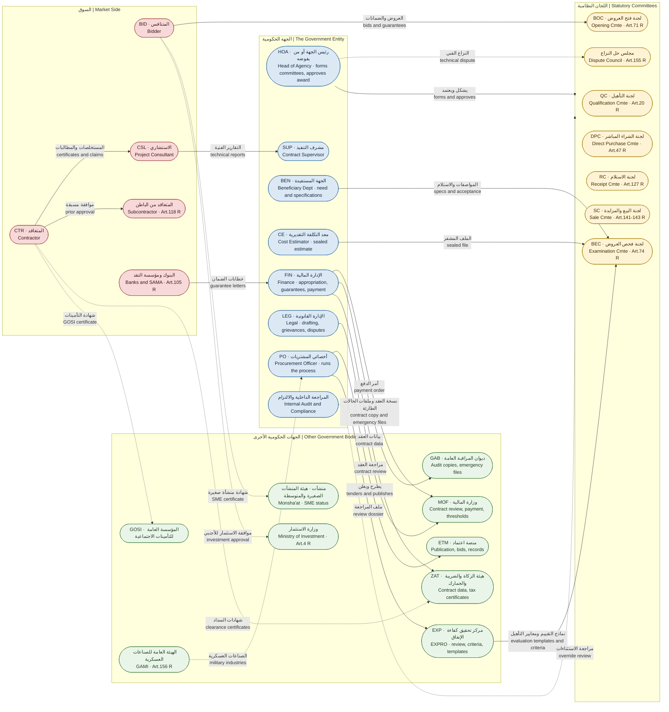

---

## 4. المرحلة 1 · التخطيط والميزانية | Phase 1 Detail

```mermaid
flowchart TB
    classDef act fill:#dce9f5,stroke:#2e6da4,color:#12283d
    classDef doc fill:#eaf5ea,stroke:#3f7d3f,color:#1d3b1d
    classDef gate fill:#f7d9d9,stroke:#a63d3d,color:#3d1414
    classDef clock fill:#f0e6f7,stroke:#7d3f9c,color:#2e1440

    P1START(["احتياج الجهة المستفيدة<br>Beneficiary need arises"])

    subgraph SP11["L5 · بناء الخطة السنوية | Build the annual plan · Art.3 R"]
        direction TB
        A111["L6 · حصر الاحتياجات من الإدارات · BEN<br>Consolidate departmental needs"]:::act
        D101A[/"L9 · D-101-01 طلب الاحتياج والشراء<br>Need and purchase request"/]:::doc
        A112["L6 · تحديد نوع وطبيعة الأعمال ومكان التنفيذ وأسلوب الطرح · PO<br>Define type, place and method · Art.3 1 a-c R"]:::act
        D101B[/"L9 · D-101-02 و D-101-03 خطة الأعمال والمشتريات السنوية<br>Annual business and procurement plan"/]:::doc
        G111{"L8 · هل الأعمال متعلقة بالأمن الوطني أو الأسلحة أو المعدات العسكرية؟<br>National security, weapons or military equipment? · Art.3 2 R"}:::gate
        D101C[/"L9 · D-101-04 مذكرة استثناء النشر<br>Publication exclusion memo"/]:::doc
        A113["L6 · النشر في البوابة وموقع الجهة والاستمرار حتى الطرح · PO<br>Publish on portal and website until tendering · Art.3 3 R"]:::act
        D101D[/"L9 · D-101-05 إثبات النشر<br>Publication evidence"/]:::doc
        A114["L7 · تحديث معلومات الخطة بشكل مستمر · PO<br>Update plan continuously · Art.3 4 R"]:::act
        D101E[/"L9 · D-101-06 سجل تحديث الخطة<br>Plan update log"/]:::doc
    end

    subgraph SP12["L5 · الجدوى والتكلفة التقديرية الأولية | Feasibility and preliminary estimate"]
        direction TB
        A121["L6 · إعداد دراسة الجدوى · BEN<br>Prepare feasibility study · Art.7 1 R"]:::act
        D101F[/"L9 · D-101-07 دراسة الجدوى<br>Feasibility study"/]:::doc
        A122["L6 · مسح الأسعار السائدة والمرجعيات السعرية والأسعار السابقة · CE<br>Survey market, references and prior prices · Art.27 1 a-d R"]:::act
        D101G[/"L9 · D-101-12 إلى D-101-14 مسح الأسعار والمرجعيات<br>Price survey and references"/]:::doc
        A123["L7 · احتساب التكلفة التقديرية الأولية · CE<br>Compute preliminary estimated cost"]:::act
        D101H[/"L9 · D-101-08 التكلفة التقديرية الأولية<br>Preliminary estimated cost"/]:::doc
    end

    subgraph SP13["L5 · مراجعة مركز تحقيق كفاءة الإنفاق | EXPRO review · Art.7 R"]
        direction TB
        G131{{"L8 · التكلفة التقديرية أكثر من 25 مليون ريال؟<br>Estimated cost exceeds SAR 25M?"}}:::gate
        A131["L6 · رفع الملف · دراسة الجدوى والتكلفة ووثائق المنافسة ووثائق التأهيل والإجراءات المتخذة · PO<br>Submit full dossier · Art.7 1 R"]:::act
        D102A[/"L9 · D-102-01 ملف العرض على المركز<br>EXPRO submission dossier"/]:::doc
        T131(("L8 · 15 يوم عمل للرد<br>15 working days to reply · Art.7 2 R")):::clock
        A132["L6 · استلام رد المركز · EXP<br>Receive EXPRO response"]:::act
        D102B[/"L9 · D-102-02 رد المركز<br>EXPRO response"/]:::doc
    end

    subgraph SP14["L5 · الارتباط المالي | Financial commitment gate · Art.25 R"]
        direction TB
        G141{{"L8 · هل تتوافر التكاليف والاعتمادات المالية؟<br>Are costs and appropriations available? · Art.25 1 R"}}:::gate
        D101I[/"L9 · D-101-09 تأكيد توافر الاعتماد المالي<br>Budget appropriation confirmation"/]:::doc
        A141["L7 · مراعاة التدفقات النقدية السنوية للعقود متعددة السنوات · FIN<br>Match annual cash flows · Art.25 1 3 R"]:::act
        D101J[/"L9 · D-101-10 جدول التدفقات النقدية السنوية<br>Annual cash-flow schedule"/]:::doc
        G142{"L8 · حاجة ماسة لتوفير الوقت؟<br>Urgent need to save time? · Art.25 2 R"}:::gate
        A142["L7 · النص في وثائق المنافسة على عدم الترسية والتوقيع قبل توفر الاعتماد · PO<br>State no award before appropriation"]:::act
        D101K[/"L9 · D-101-11 إفادة الطرح قبل توفر الاعتماد<br>Pre-appropriation tendering statement"/]:::doc
        A143["L7 · التحقق من قوائم المشتريات المتكررة والاتفاقيات الإطارية القائمة · PO<br>Check unified lists and existing framework agreements · Art.6 2 and 46 3 R"]:::act
        D101L[/"L9 · D-101-15 و D-101-16 محاضر التحقق<br>Availability check records"/]:::doc
    end

    P1END(["الانتقال إلى المرحلة 2<br>Proceed to Phase 2"])

    P1START --> A111 --> D101A --> A112 --> D101B --> G111
    G111 -->|"نعم · Yes"| D101C --> A114
    G111 -->|"لا · No"| A113 --> D101D --> A114 --> D101E
    D101E --> A121 --> D101F --> A122 --> D101G --> A123 --> D101H --> G131
    G131 -->|"نعم · Yes"| A131 --> D102A --> T131 --> A132 --> D102B --> G141
    G131 -->|"لا · No"| G141
    G141 -->|"نعم · Yes"| D101I --> A141 --> D101J --> A143
    G141 -->|"لا · No"| G142
    G142 -->|"نعم · Yes"| A142 --> D101K --> A143
    G142 -->|"لا · No"| P1START
    A143 --> D101L --> P1END
```

---

## 5. المرحلة 2 · اختيار الأسلوب والإعداد والطرح | Phase 2 Detail

### 5.1 شجرة اختيار أسلوب التعاقد | Contracting method decision tree · Art.32 R

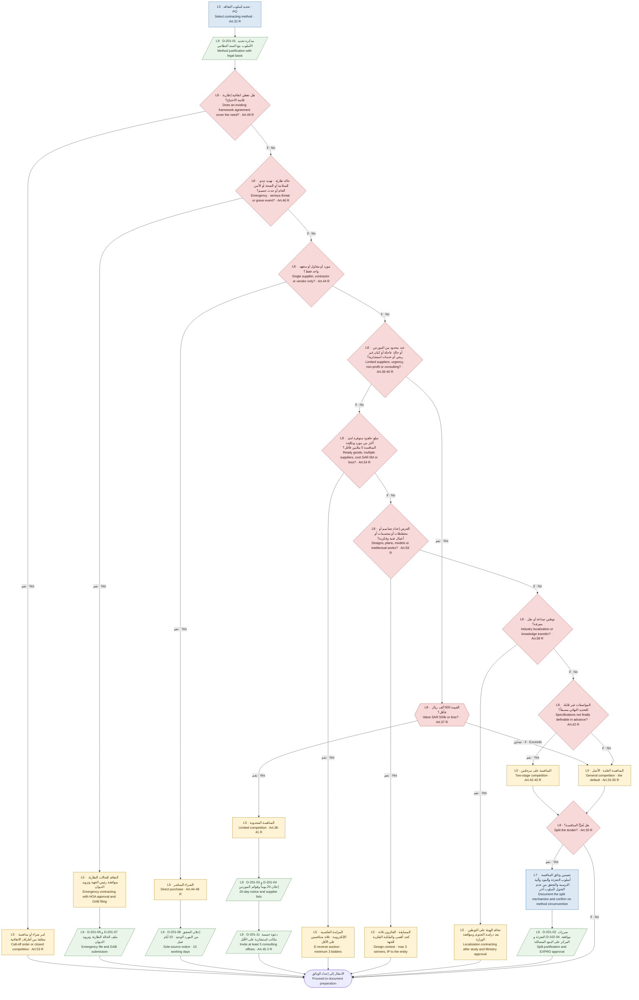

### 5.2 إعداد وثائق المنافسة والتكلفة التقديرية والتأهيل المسبق | Documents, estimated cost and pre-qualification

```mermaid
flowchart TB
    classDef act fill:#dce9f5,stroke:#2e6da4,color:#12283d
    classDef doc fill:#eaf5ea,stroke:#3f7d3f,color:#1d3b1d
    classDef gate fill:#f7d9d9,stroke:#a63d3d,color:#3d1414
    classDef seal fill:#3d1440,stroke:#1c0920,color:#ffffff
    classDef clock fill:#f0e6f7,stroke:#7d3f9c,color:#2e1440

    subgraph SP21["L5 · إعداد وثائق المنافسة | Prepare tender documents · Art.21 R"]
        direction TB
        A211["L6 · تجميع مكونات كراسة الشروط والمواصفات · PO و BEN<br>Assemble the tender document set"]:::act
        subgraph DOCS["L9 · مكونات وثائق المنافسة الإلزامية | Mandatory components · Art.21 1-13 R"]
            direction TB
            DD1[/"1 تعليمات وشروط المنافسة<br>Instructions and conditions"/]:::doc
            DD2[/"2 شروط ومواصفات الأعمال والمشتريات<br>Terms and specifications"/]:::doc
            DD3[/"3 جداول وبنود الكميات أو معايير تقديم الخدمة<br>BOQ or service delivery standards"/]:::doc
            DD4[/"4 معايير ونسب تقييم العروض<br>Evaluation criteria and weights"/]:::doc
            DD5[/"5 مجال التصنيف إن وجد<br>Classification field if any"/]:::doc
            DD6[/"6 المخططات والرسومات<br>Drawings and plans"/]:::doc
            DD7[/"7 مكان وزمان وآلية تسليم العينات ومصيرها بعد الفحص<br>Samples protocol"/]:::doc
            DD8[/"8 نص العقد المزمع إبرامه وطرق الدفع وآلية احتساب الغرامات<br>Draft contract, payment and penalties"/]:::doc
            DD9[/"9 شروط وأحكام المحتوى المحلي<br>Local content conditions"/]:::doc
            DD10[/"10 الضمان الابتدائي والنهائي<br>Initial and final guarantees"/]:::doc
            DD11[/"11 شروط وأحكام الاتفاقية الإطارية إن وجدت<br>Framework agreement terms"/]:::doc
            DD12[/"12 مدة التوقف للنظر في التظلم<br>Standstill period"/]:::doc
            DD13[/"13 أي وثائق أخرى بحسب طبيعة الأعمال<br>Other documents by nature of works"/]:::doc
        end
        G211{{"L8 · ضوابط المواصفات · لا علامة تجارية ولا رقم في قوائم الموردين ولا كميات غير محددة<br>Specification controls · no brand, no supplier list number, no undefined quantities · Art.24 R"}}:::gate
        A212["L7 · تحديث ومراجعة المواصفات والمخططات قبل الطرح · BEN<br>Review and update specs before tendering · Art.26 R"]:::act
        A213["L7 · تحديد تكاليف وثائق المنافسة بدقة دون مبالغة · PO<br>Set document costs accurately · Art.23 R"]:::act
        D2X13[/"L9 · D-2X-13 كشف تكاليف الوثائق<br>Document pricing sheet"/]:::doc
        A214["L7 · اعتماد اللغة العربية أو تحديد اللغة المعتمدة مع نسخة مترجمة · LEG<br>Arabic or defined language with translation · Art.5 2 R"]:::act
    end

    subgraph SP22["L5 · التكلفة التقديرية | Estimated cost · Art.27 R"]
        direction TB
        A221["L6 · الاستعانة بالجهاز الفني والجهات المتخصصة بالتسعير · CE<br>Consult technical and specialised pricing bodies"]:::act
        A222["L7 · وضع أسعار استرشادية لبنود الكميات تعكس القيمة الفعلية · CE<br>Set indicative prices reflecting actual value"]:::act
        D2X20[/"L9 · D-2X-20 الأسعار التقديرية الاسترشادية<br>Indicative estimated prices"/]:::doc
        A223["L8 · وضع الأسعار في ملف إلكتروني مشفر وإرساله إلى رئيس لجنة فحص العروض قبل الإعلان<br>Encrypt into an electronic file and send to the BEC chair before announcement · Art.27 1 j R"]:::seal
        D2X22[/"L9 · D-2X-22 ملف الأسعار التقديرية المشفر ومحضر التسليم<br>Encrypted estimate file and transmission record"/]:::doc
        G221{{"L8 · تلغى المنافسة إذا لم تضع الجهة أسعاراً تقديرية<br>Tender is cancelled if no estimated prices are set · Art.27 3 R"}}:::gate
        A224["L8 · المحافظة على سرية الأسعار من الجهة والمركز وجميع المشاركين<br>All parties maintain confidentiality · Art.27 2 R"]:::seal
        D2X23[/"L9 · D-2X-23 تعهدات السرية<br>Confidentiality undertakings · Art.1 2 R"/]:::doc
    end

    subgraph SP23["L5 · التأهيل المسبق | Pre-qualification · Art.15-20 R"]
        direction TB
        G231{{"L8 · مشروع كبير أو معقد أو تكلفة تزيد على 50 مليون ريال؟<br>Major, complex or exceeding SAR 50M? · Art.15 1 R"}}:::gate
        G232{"L8 · استثناء · المسابقة أو الشراء المباشر بمئة ألف فأقل أو حالة طارئة؟<br>Exempt · contest, direct purchase up to SAR 100k, or emergency? · Art.15 4 R"}:::gate
        A231["L6 · تكوين لجنة التأهيل · ثلاثة أعضاء فأكثر إضافة إلى رئيسها وأحدهم فني ونائب للرئيس وتعاد كل ثلاث سنوات · HOA<br>Form the qualification committee · Art.20 R"]:::act
        D2X30[/"L9 · D-2X-30 قرار تكوين لجنة التأهيل<br>Committee formation decision"/]:::doc
        A232["L7 · وضع المعايير · القدرات المالية والإدارية والفنية وحجم الالتزامات القائمة والمشاريع المنجزة والخبرات وحجم المشروع ونتائج التقييمات السابقة · PO<br>Set the seven criteria · Art.17 2 R"]:::act
        D2X31[/"L9 · D-2X-31 معايير التأهيل المعتمدة من المركز<br>EXPRO-approved criteria · Art.17 1 R"/]:::doc
        A233["L7 · الإعلان عن التأهيل متضمناً اسم الجهة ونوع المشروع ومكانه والمعايير والإجراءات وموعد التقديم وموعد إعلان المؤهلين · PO<br>Announce pre-qualification · Art.18 R"]:::act
        D2X33[/"L9 · D-2X-33 إعلان التأهيل المسبق<br>Pre-qualification announcement"/]:::doc
        A234["L7 · استقبال طلبات التأهيل وتقييمها · QC<br>Receive and evaluate applications"]:::act
        D2X35[/"L9 · D-2X-35 و D-2X-36 طلبات التأهيل وكشوف التقييم<br>Applications and scoring sheets"/]:::doc
        G233{"L8 · هل تقدم أو اجتاز أكثر من متنافس واحد؟<br>More than one qualified applicant? · Art.19 1 a R"}:::gate
        A235["L8 · مراجعة المعايير وإعادة التأهيل أو إلغاؤه والتحول إلى التأهيل اللاحق · HOA<br>Review criteria, re-run, or convert to post-qualification"]:::act
        A236["L7 · إبلاغ كل متقدم بنتيجة تأهيله وأسباب استبعاده · QC<br>Notify each applicant with exclusion reasons · Art.19 1 b R"]:::act
        D2X37[/"L9 · D-2X-37 إشعار نتيجة التأهيل<br>Qualification result notice"/]:::doc
        A237["L7 · دعوة من اجتاز التأهيل لاستكمال إجراءات المنافسة · PO<br>Invite qualified bidders · Art.19 2 R"]:::act
    end

    subgraph SP24["L5 · الإعلان عن المنافسة | Tender announcement · Art.33-34 R"]
        direction TB
        A241["L6 · إعداد الإعلان متضمناً اسم الجهة ورقم المنافسة ووصفها والغرض ومجال التصنيف وتكاليف الوثائق ومكان دفعها وآخر موعد للاستقبال وتاريخ الفتح · PO<br>Compose the announcement · Art.33 4 R"]:::act
        D202A[/"L9 · D-202-01 إعلان المنافسة<br>Tender announcement"/]:::doc
        G241{{"L8 · احتساب مدة الإعلان بحسب التكلفة التقديرية<br>Advertising period by estimated cost · Art.34 1 R"}}:::gate
        T241(("15 يوماً · 5 ملايين فأقل<br>15 days · up to SAR 5M")):::clock
        T242(("30 يوماً · أكثر من 5 ملايين وأقل من 100 مليون<br>30 days · SAR 5M to under 100M")):::clock
        T243(("60 يوماً · 100 مليون فأكثر<br>60 days · SAR 100M and above")):::clock
        G242{"L8 · طلب تقليص المدة بموافقة الوزير؟<br>Shorten the period with Minister approval? · Art.34 2 R"}:::gate
        A242["L7 · الإعلان خارج المملكة بالعربية والإنجليزية ولغة بلد الإعلان · PO<br>Publish abroad in Arabic, English and local language · Art.33 2-3 R"]:::act
        A243["L7 · النشر في الجريدة الرسمية والموقع عند تعذر البوابة لأسباب فنية · PO<br>Gazette and website on portal failure · Art.33 5 R"]:::act
        A244["L6 · استقبال الاستفسارات والرد عليها ونشرها للجميع دون كشف هوية المستفسر · PO<br>Publish answers to all, questioner masked · Art.9 5 R"]:::act
        D202G[/"L9 · D-202-07 و D-202-08 سجل الاستفسارات والردود المنشورة<br>Inquiry log and published answers"/]:::doc
        G243{"L8 · تعديل على وثائق المنافسة؟<br>Amendment to the documents?"}:::gate
        A245["L8 · إبلاغ كافة المتقدمين بأي تعديل · PO<br>Notify all bidders of any amendment · Art.1 3 R"]:::act
        D202I[/"L9 · D-202-09 إشعار التعديل وإثبات التعميم<br>Addendum and broadcast evidence"/]:::doc
        G244{"L8 · تمديد قبول العروض وتأجيل الفتح؟<br>Extend receipt and postpone opening? · Art.73 R"}:::gate
        A246["L7 · الإعلان عن التمديد وإشعار مشتري الوثائق · PO<br>Announce extension and notify document buyers"]:::act
    end

    A211 --> DOCS --> G211 --> A212 --> A213 --> D2X13 --> A214
    A214 --> A221 --> A222 --> D2X20 --> A223 --> D2X22 --> G221 --> A224 --> D2X23
    D2X23 --> G231
    G231 -->|"نعم · Yes"| G232
    G232 -->|"لا · No"| A231 --> D2X30 --> A232 --> D2X31 --> A233 --> D2X33 --> A234 --> D2X35 --> G233
    G233 -->|"لا · No"| A235 --> A241
    G233 -->|"نعم · Yes"| A236 --> D2X37 --> A237 --> A241
    G232 -->|"نعم · Yes"| A241
    G231 -->|"لا · No"| A241
    A241 --> D202A --> G241
    G241 --> T241 --> G242
    G241 --> T242 --> G242
    G241 --> T243 --> G242
    G242 --> A242 --> A243 --> A244 --> D202G --> G243
    G243 -->|"نعم · Yes"| A245 --> D202I --> G244
    G243 -->|"لا · No"| G244
    G244 -->|"نعم · Yes"| A246 --> P2END(["الانتقال إلى المرحلة 3<br>Proceed to Phase 3"])
    G244 -->|"لا · No"| P2END
```

---

## 6. المرحلة 3 · التقديم والفتح والفحص | Phase 3 Detail

### 6.1 تقديم العروض وفتحها | Submission and opening

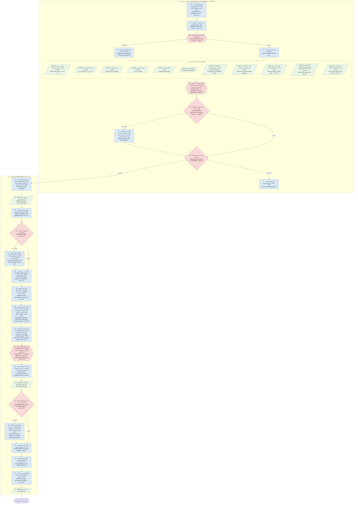

### 6.2 فحص العروض وتقييمها والتفاوض | Examination, evaluation and negotiation

```mermaid
flowchart TB
    classDef act fill:#dce9f5,stroke:#2e6da4,color:#12283d
    classDef doc fill:#eaf5ea,stroke:#3f7d3f,color:#1d3b1d
    classDef gate fill:#f7d9d9,stroke:#a63d3d,color:#3d1414
    classDef clock fill:#f0e6f7,stroke:#7d3f9c,color:#2e1440
    classDef seal fill:#3d1440,stroke:#1c0920,color:#ffffff

    subgraph SP33["L5 · تكوين اللجنة والتقييم الفني | Committee and technical evaluation"]
        direction TB
        A331["L6 · تكوين لجنة فحص العروض · ثلاثة أعضاء فأكثر إضافة إلى رئيسها من بينهم المراقب المالي وعضو من ذوي التأهيل النظامي وعضو فني ونائب واحتياطي لكل عضو وسكرتير وتعاد كل ثلاث سنوات · HOA<br>Form the examination committee · Art.74 R"]:::act
        D303A[/"L9 · D-303-01 قرار تكوين لجنة فحص العروض<br>BEC formation decision"/]:::doc
        G331{{"L8 · عدم الجمع بين عضوية أو رئاسة هذه اللجنة وأي لجنة أخرى<br>No overlap with any other committee · Art.20 2 and 47 1 R"}}:::gate
        D303B[/"L9 · D-303-02 إقرار عدم الجمع<br>Non-overlap declaration"/]:::doc
        A332["L6 · التقييم وفق معايير التقييم وشروط المنافسة المعلنة · BEC<br>Evaluate strictly against the published criteria · Art.75 R"]:::act
        D303C[/"L9 · D-303-03 كشوف التقييم الفني<br>Technical evaluation sheets"/]:::doc
        G332{"L8 · الأعمال لا تتطلب قدرات فنية عالية؟<br>Works not requiring high technical capacity? · Art.29 1 R"}:::gate
        A333["L7 · التقييم الفني على أساس الاجتياز من عدمه والفائز هو الأدنى سعراً<br>Pass or fail technical, lowest price wins"]:::act
        A334["L7 · النسبة الأعلى للأوزان الفنية في الخدمات الاستشارية<br>Highest weighting to technical criteria in consulting · Art.29 2 R"]:::act
        G333{"L8 · وجود بيانات أو غموض في العروض؟<br>Data or ambiguity requiring clarification? · Art.76 1 R"}:::gate
        A335["L8 · طلب الإيضاح كتابة دون إخلال بتكافؤ الفرص ودون تغيير في مسائل جوهرية كالأسعار ودون تحويل عرض مخالف إلى مقبول<br>Written clarification only, no material change · Art.76 1 R"]:::act
        D303D[/"L9 · D-303-04 طلبات الإيضاح والردود الكتابية<br>Clarification requests and replies"/]:::doc
        G334{"L8 · نقص أو انتهاء صلاحية الشهادات المطلوبة؟<br>Missing or expired certificates? · Art.77 R"}:::gate
        T331(("L8 · مهلة لا تزيد على 10 أيام عمل<br>Not more than 10 working days")):::clock
        A336["L8 · الاستبعاد من المنافسة ومصادرة الضمان الابتدائي عند عدم التقديم في الوقت المحدد<br>Exclude and confiscate the initial guarantee"]:::act
        G335{"L8 · نقص في قيمة الضمان الابتدائي لا يتجاوز 10 بالمئة؟<br>Initial guarantee shortfall up to 10 percent? · Art.70 1 R"}:::gate
        A337["L8 · طلب استكمال النقص خلال 10 أيام عمل وإلا عُد منسحباً<br>Complete within 10 working days or deemed withdrawn"]:::act
    end

    subgraph SP34["L5 · فتح العروض المالية والتدقيق | Financial opening and audit"]
        direction TB
        A341["L8 · إعادة العروض المالية الخاصة بالعروض المقبولة فنياً إلى لجنة فتح العروض لفتحها · BEC<br>Return technically accepted financial files to the BOC · Art.78 1 a R"]:::act
        A342["L8 · فتح ملف الأسعار التقديرية بعد تلقي محضر فتح العروض المالية · BEC<br>Unseal the estimated price file after receiving the financial opening minutes · Art.78 1 b R"]:::seal
        D303I[/"L9 · D-303-09 محضر فك تشفير التكلفة التقديرية<br>Estimate unsealing minutes"/]:::doc
        A343["L7 · مراجعة جداول الكميات والأسعار وإجراء التصحيحات الحسابية · BEC<br>Review BOQ and perform arithmetic corrections · Art.81 1 R"]:::act
        A344["L8 · ترجيح السعر المبين كتابة عند الاختلاف مع الرقم وترجيح سعر الوحدة عند اختلافه مع المجموع ما لم يوجد خطأ مادي · BEC<br>Words prevail over figures, unit price prevails over total · Art.81 2 R"]:::act
        D303J[/"L9 · D-303-10 كشف التصحيحات الحسابية<br>Arithmetic correction schedule"/]:::doc
        G341{{"L8 · تجاوز الأخطاء الحسابية 10 بالمئة من قائمة الأسعار أو إجمالي قيمة العرض؟<br>Errors exceed 10 percent? · Art.81 3 R"}}:::gate
        A345["L8 · التوصية باستبعاد العرض<br>Recommend exclusion"]:::act
        G342{"L8 · بنود غير مسعرة أو مغفلة؟<br>Unpriced or omitted items? · Art.79 R"}:::gate
        A346["L8 · استبعاد العرض أو اعتبار البنود غير المسعرة محملة على القيمة الإجمالية ويعد المتنافس موافقاً على هذا الشرط<br>Exclude, or treat items as loaded on the total · Art.79 1 R"]:::act
    end

    subgraph SP35["L5 · اعتدال الأسعار والتفاوض | Price reasonableness and negotiation"]
        direction TB
        A351["L7 · التأكد من اعتدال سعر أفضل العروض بالاسترشاد بالأسعار الأخيرة والأسعار السائدة والتقديرية · BEC<br>Verify price reasonableness · Art.82 1 R"]:::act
        G351{"L8 · بنود موضوعة بشكل غير مدروس ولا تمثل السعر الحقيقي؟<br>Items priced unrealistically? · Art.82 2 R"}:::gate
        A352["L8 · طلب إعادة التسعير دون التأثير على السعر الإجمالي وعند الرفض يُستبعد ويرد ضمانه<br>Request re-pricing without changing the total; refusal means exclusion"]:::act
        G352{{"L8 · أسعار العرض تقل بنسبة 25 بالمئة فأكثر عن التكلفة التقديرية؟<br>Prices 25 percent or more below the estimate? · Art.84 R"}}:::gate
        A353["L8 · مناقشة صاحب العرض ومراعاة كفاءته وسبق تأهيله وخضوع عرضه الفني للتقييم وطبيعة الأعمال وألا يؤثر التدني على التنفيذ · BEC<br>Discuss with the bidder, weigh capability and delivery risk"]:::act
        D303N[/"L9 · D-303-14 تحليل العرض المنخفض<br>Abnormally low bid analysis"/]:::doc
        G353{"L8 · السعر يتجاوز الميزانية أو أسعار السوق؟<br>Price exceeds budget or market? · Art.83 R"}:::gate
        A354["L8 · التفاوض للوصول إلى المبلغ المحدد أو المطلوب ثم الترسية على من يصل سعره إليه<br>Negotiate to reach the required amount then award · Art.83 1 R"]:::act
        D303O[/"L9 · D-303-15 محضر التفاوض<br>Negotiation minutes"/]:::doc
        G354{"L8 · إخفاق التفاوض؟<br>Negotiation failed?"}:::gate
        A355["L8 · توصية لجنة فحص العروض إلى صاحب الصلاحية بإلغاء المنافسة ويتوجب عليه إلغاؤها<br>Recommend cancellation to the authority holder · Art.83 2 R"]:::act
        G355{"L8 · تساوي عرضان أو أكثر في التقييم الكلي؟<br>Two or more bids tied? · Art.80 R"}:::gate
        A356["L8 · الترسية على أقل العروض سعراً ثم التجزئة إن سمحت الشروط ثم الأولوية للمنشآت الصغيرة والمتوسطة المحلية ثم منافسة مغلقة بين العروض المتساوية<br>Lowest price, then split, then local SME priority, then closed competition"]:::act
    end

    subgraph SP36["L5 · سريان العروض والتأهيل اللاحق والتوصية | Validity, post-qualification, recommendation"]
        direction TB
        G361{"L8 · تعذر البت في الترسية خلال مدة سريان العروض؟<br>Award not decided within bid validity? · Art.67 R"}:::gate
        A361["L8 · إعداد محضر يوضح أسباب ومبررات التأخير وإشعار أصحاب العروض برغبة التمديد لمدة لا تزيد على 90 يوماً<br>Minutes with reasons and extension request up to 90 days"]:::act
        T361(("L8 · رد المتنافس خلال أسبوعين وإلا عُد غير موافق<br>Bidder replies within 2 weeks")):::clock
        A362["L7 · تمديد الضمان الابتدائي مع الموافقة على التمديد<br>Extend the initial guarantee with consent"]:::act
        G362{{"L8 · مضي المدد · لا يجوز التمديد إلا بموافقة الوزارة وإلا تلغى المنافسة<br>Periods elapsed · Ministry approval required or cancel · Art.67 3 R"}}:::gate
        G363{{"L8 · مضى أكثر من سنة على التأهيل المسبق أو لم يجر تأهيل؟<br>More than one year since pre-qualification, or none? · Art.16 R"}}:::gate
        A363["L7 · إجراء التأهيل اللاحق لصاحب العرض الفائز بذات معايير التأهيل المسبق · QC<br>Post-qualify the winner using the same criteria · Art.16 3 R"]:::act
        G364{"L8 · اجتاز صاحب العرض الفائز التأهيل اللاحق؟<br>Winner passed post-qualification?"}:::gate
        A364["L8 · الانتقال إلى صاحب العرض الذي يليه في الترتيب وهكذا وتلغى المنافسة إذا لم يجتزها جميع المتنافسين<br>Move to the next ranked bidder; cancel if none passes · Art.16 2 R"]:::act
        A365["L6 · رفع محضر لجنة فحص العروض وتوصية الترسية إلى صاحب الصلاحية · BEC<br>Submit the report and award recommendation"]:::act
        D303V[/"L9 · D-303-22 محضر لجنة فحص العروض وتوصية الترسية<br>BEC report and award recommendation"/]:::doc
    end

    CANC(["إلغاء المنافسة وإعادة تكاليف الوثائق<br>Cancel and refund document costs · Art.86 R"])

    A331 --> D303A --> G331 --> D303B --> A332 --> D303C --> G332
    G332 -->|"نعم · Yes"| A333 --> G333
    G332 -->|"لا · No"| A334 --> G333
    G333 -->|"نعم · Yes"| A335 --> D303D --> G334
    G333 -->|"لا · No"| G334
    G334 -->|"نعم · Yes"| T331 --> A336
    G334 -->|"لا · No"| G335
    A336 --> G335
    G335 -->|"نعم · Yes"| A337 --> A341
    G335 -->|"لا · No"| A341
    A341 --> A342 --> D303I --> A343 --> A344 --> D303J --> G341
    G341 -->|"نعم · Yes"| A345 --> G342
    G341 -->|"لا · No"| G342
    G342 -->|"نعم · Yes"| A346 --> A351
    G342 -->|"لا · No"| A351
    A351 --> G351
    G351 -->|"نعم · Yes"| A352 --> G352
    G351 -->|"لا · No"| G352
    G352 -->|"نعم · Yes"| A353 --> D303N --> G353
    G352 -->|"لا · No"| G353
    G353 -->|"نعم · Yes"| A354 --> D303O --> G354
    G353 -->|"لا · No"| G355
    G354 -->|"نعم · Yes"| A355 --> CANC
    G354 -->|"لا · No"| G355
    G355 -->|"نعم · Yes"| A356 --> G361
    G355 -->|"لا · No"| G361
    G361 -->|"نعم · Yes"| A361 --> T361 --> A362 --> G362
    G361 -->|"لا · No"| G363
    G362 --> G363
    G363 -->|"نعم · Yes"| A363 --> G364
    G363 -->|"لا · No"| A365
    G364 -->|"لا · No"| A364 --> A365
    G364 -->|"نعم · Yes"| A365
    A365 --> D303V --> P4(["الانتقال إلى المرحلة 4<br>Proceed to Phase 4"])
```

---

## 7. المرحلة 4 · الترسية وفترة التوقف والتظلم | Phase 4 Detail

```mermaid
flowchart TB
    classDef act fill:#dce9f5,stroke:#2e6da4,color:#12283d
    classDef doc fill:#eaf5ea,stroke:#3f7d3f,color:#1d3b1d
    classDef gate fill:#f7d9d9,stroke:#a63d3d,color:#3d1414
    classDef clock fill:#f0e6f7,stroke:#7d3f9c,color:#2e1440

    subgraph SP41["L5 · قرار الترسية | Award decision"]
        direction TB
        A411["L6 · اعتماد التوصية وإصدار قرار الترسية · HOA<br>Approve the recommendation and issue the award decision"]:::act
        A412["L8 · النص في قرار الترسية على عدم ترتب أي التزام قانوني أو مالي على الجهة إلا بعد توقيع العقد من جميع الأطراف · LEG<br>State that no obligation arises before signature by all parties · Art.25 4 R"]:::act
        D401A[/"L9 · D-401-01 و D-401-02 قرار الترسية<br>Award decision"/]:::doc
        A413["L6 · إعلان العرض الفائز في البوابة وإبلاغ صاحبه متضمناً صاحب العرض الفائز ومعلومات المشروع والقيمة الإجمالية ومدة ومكان التنفيذ · PO<br>Publish and notify · Art.85 1 R"]:::act
        D401C[/"L9 · D-401-03 و D-401-04 إعلان الترسية وإشعار الفائز<br>Award announcement and winner notice"/]:::doc
        A414["L7 · إبلاغ المتنافسين الآخرين بالنتائج وأسباب استبعادهم بما في ذلك الدرجات الفنية لعروضهم · PO<br>Notify other bidders with reasons and technical scores · Art.85 2 R"]:::act
        D401E[/"L9 · D-401-05 إشعارات المتنافسين<br>Bidder notifications"/]:::doc
    end

    subgraph SP42["L5 · فترة التوقف | Standstill period · Art.87 R"]
        direction TB
        A421["L8 · الإعلان في البوابة عن فترة التوقف · لا تقل عن 5 أيام عمل ولا تزيد على 10 أيام عمل من تاريخ صدور قرار الترسية · PO<br>Announce the standstill · 5 to 10 working days"]:::act
        T421(("L8 · 5 إلى 10 أيام عمل<br>5 to 10 working days")):::clock
        D402A[/"L9 · D-402-01 إعلان فترة التوقف<br>Standstill announcement"/]:::doc
        G421{"L8 · تعذر الإعلان في البوابة أو الموقع لأسباب فنية؟<br>Publication impossible for technical reasons? · Art.87 2 R"}:::gate
        A422["L7 · إبلاغ المتنافسين عبر البريد الإلكتروني · PO<br>Notify bidders by email"]:::act
        G422{{"L8 · لا يعد قرار الترسية نافذاً حتى تنتهي فترة التوقف ويتم البت في التظلمات<br>The award is not effective until standstill closes and grievances are decided · Art.87 5 R"}}:::gate
    end

    subgraph SP43["L5 · التظلم | Grievance · Art.87 and 153 R"]
        direction TB
        G431{"L8 · قُدِّم تظلم على قرار الترسية أو أي إجراء؟<br>Grievance filed against the award or any procedure? · Art.87 3 R"}:::gate
        A431["L7 · تقديم التظلم عبر البوابة مرفقاً به الضمان · BID<br>File the grievance through the portal with a guarantee"]:::act
        D402D[/"L9 · D-402-03 و D-402-04 التظلم وضمان التظلم ساري 30 يوماً على الأقل<br>Grievance and guarantee valid at least 30 days"/]:::doc
        G432{{"L8 · لا يجوز قبول التظلم عند عدم تقديم الضمان أو تقديمه ناقصاً<br>No grievance accepted without a complete guarantee · Art.153 2 R"}}:::gate
        A432["L8 · لا يلزم المتظلم بتجديد مدة الضمان عند انتهاء سريان مفعوله دون البت في التظلم<br>No renewal required if the period lapses undecided · Art.153 4 R"]:::act
        A433["L6 · البت في التظلم · الجهة أو لجنة النظر في الشكاوى<br>Decide the grievance · entity or review committee"]:::act
        D402F[/"L9 · D-402-06 قرار البت في التظلم<br>Grievance decision"/]:::doc
        G433{"L8 · قُبل التظلم؟<br>Grievance upheld?"}:::gate
        A434["L8 · تصحيح الإجراء أو إلغاء المنافسة · HOA<br>Corrective action or cancellation · Art.86 1 b R"]:::act
        G434{{"L8 · لا يجوز قبول أي تظلم بعد انتهاء فترة التوقف<br>No grievance accepted after the standstill expires · Art.87 4 R"}}:::gate
    end

    subgraph SP44["L5 · الضمانات والنشر | Guarantees and publication"]
        direction TB
        A441["L7 · رد الضمانات الابتدائية لأصحاب العروض التي لم يتم الترسية عليها · FIN<br>Return initial guarantees to unsuccessful bidders · Art.70 4 R"]:::act
        A442["L7 · نشر نتائج وبيانات المنافسات التي تزيد قيمتها على 100 ألف ريال خلال 30 يوماً من التعاقد · PO<br>Publish results for values above SAR 100k within 30 days · Art.85 3 R"]:::act
        T441(("L8 · 30 يوماً من التعاقد<br>30 days from contracting")):::clock
        D401F[/"L9 · D-401-06 بيانات العقد المنشورة · اسم المتعاقد وعنوانه ونوع العقد ومدته وقيمته ومكان التنفيذ وتاريخ تسليم الموقع وتاريخ استلام الأعمال<br>Published contract data"/]:::doc
        G441{"L8 · أسلحة أو ذخائر أو معدات عسكرية أو متعلقة بالأمن الوطني؟<br>Weapons, ammunition, military equipment or national security? · Art.85 4 R"}:::gate
        A443["L7 · الاستثناء من الإعلان والنشر · HOA<br>Exempt from announcement and publication"]:::act
    end

    CANC4(["إلغاء المنافسة وإعادة تكاليف الوثائق<br>Cancel and refund · Art.86 R"])
    P5(["الانتقال إلى المرحلة 5<br>Proceed to Phase 5"])

    A411 --> A412 --> D401A --> A413 --> D401C --> A414 --> D401E --> A421
    A421 --> T421 --> D402A --> G421
    G421 -->|"نعم · Yes"| A422 --> G431
    G421 -->|"لا · No"| G431
    G431 -->|"نعم · Yes"| A431 --> D402D --> G432 --> A432 --> A433 --> D402F --> G433
    G433 -->|"نعم · Yes"| A434 --> CANC4
    G433 -->|"لا · No"| G434
    G431 -->|"لا · No"| G434
    G434 --> G422 --> A441 --> G441
    G441 -->|"نعم · Yes"| A443 --> P5
    G441 -->|"لا · No"| A442 --> T441 --> D401F --> P5
```

---

## 8. المرحلة 5 · التعاقد وتسليم الموقع والتنفيذ والصرف | Phase 5 Detail

### 8.1 الضمان النهائي وإبرام العقد | Final guarantee and contract execution

```mermaid
flowchart TB
    classDef act fill:#dce9f5,stroke:#2e6da4,color:#12283d
    classDef doc fill:#eaf5ea,stroke:#3f7d3f,color:#1d3b1d
    classDef gate fill:#f7d9d9,stroke:#a63d3d,color:#3d1414
    classDef clock fill:#f0e6f7,stroke:#7d3f9c,color:#2e1440

    subgraph SP51["L5 · الضمان النهائي | Final guarantee · Art.100-107 R"]
        direction TB
        A511["L6 · طلب الضمان النهائي بنسبة 5 بالمئة من قيمة العقد · PO<br>Request the 5 percent final guarantee · Art.61 L"]:::act
        G511{"L8 · مصلحة المشروع تقتضي رفع النسبة؟<br>Project interest requires a higher ratio? · Art.100 R"}:::gate
        A512["L8 · أخذ موافقة الوزير المسبقة قبل طرح الأعمال والنص على النسبة في وثائق المنافسة<br>Prior Minister approval before tendering and stated in the documents"]:::act
        A513["L7 · تقديم الضمان من بنك محلي أو بنك أجنبي معتمد من مؤسسة النقد أو عبر بنك محلي · CTR<br>Provide the guarantee from an eligible bank · Art.105 1-2 R"]:::act
        D501B[/"L9 · D-501-02 خطاب الضمان النهائي · غير مشروط وغير قابل للإلغاء وواجب الدفع عند أول طلب وخالٍ من الحسومات<br>Final guarantee letter"/]:::doc
        A514["L8 · التأكد من صحة كافة الضمانات فور تلقيها من خلال البنوك مصدرة الضمانات · FIN<br>Verify authenticity with the issuing banks immediately · Art.105 3 R"]:::act
        D501D[/"L9 · D-501-04 محضر التحقق من الضمان<br>Guarantee verification record"/]:::doc
        A515["L7 · إنشاء سجلات خاصة لمراقبة الضمانات ومتابعة التمديد والمصادرة والإفراج · FIN<br>Maintain guarantee monitoring records · Art.105 7 R"]:::act
    end

    subgraph SP52["L5 · مراجعة العقد | Contract review · Art.93 R"]
        direction TB
        A521["L7 · مراجعة العقد من الناحية القانونية والصياغية والتأكد من مطابقته لنماذج العقود المعتمدة · LEG<br>Legal and drafting review against approved templates"]:::act
        D502A[/"L9 · D-502-01 محضر المراجعة القانونية<br>Legal review record"/]:::doc
        G521{{"L8 · مدة التنفيذ تزيد على سنة أو القيمة 5 ملايين ريال فأكثر؟<br>Term exceeds one year or value SAR 5M or more?"}}:::gate
        A522["L6 · عرض العقد على وزارة المالية لمراجعته مالياً قبل توقيعه · FIN<br>Submit to the Ministry of Finance for financial review"]:::act
        D502C[/"L9 · D-502-03 و D-502-04 ملف المراجعة ورد الوزارة<br>Review file and Ministry response"/]:::doc
        G522{"L8 · قيمة العقد التقديرية تتجاوز 100 مليون ريال ويراد التحكيم؟<br>Value above SAR 100M and arbitration sought? · Art.154 R"}:::gate
        A523["L8 · النص على التحكيم وشروطه في وثائق العقد وتطبيق أنظمة المملكة على موضوع المنازعة وموافقة الوزير<br>State arbitration, apply Saudi law, obtain Minister approval"]:::act
    end

    subgraph SP53["L5 · التوقيع والتوزيع | Signature and distribution · Art.88-90 R"]
        direction TB
        A531["L6 · تحديد موعد لتوقيع العقد بعد تقديم الضمان النهائي وإشعار المتعاقد · PO<br>Set the signature date and notify the contractor"]:::act
        G531{"L8 · تأخر المتعاقد عن الموعد دون عذر مقبول؟<br>Contractor late without acceptable excuse?"}:::gate
        A532["L8 · إنذار المتعاقد<br>Warn the contractor"]:::act
        T531(("L8 · 15 يوماً من تاريخ الإنذار<br>15 days from the warning")):::clock
        A533["L8 · إنهاء التعاقد بقرار من صاحب الصلاحية ومصادرة الضمان النهائي مع حق الرجوع بالتعويض وتزويد لجنة المادة 88 من النظام بنسخة من القرار<br>Terminate, confiscate and refer to the Art.88 L committee"]:::act
        A534["L6 · تحرير العقد من ست نسخ على الأقل · HOA<br>Execute the contract in at least six copies · Art.89 1 R"]:::act
        subgraph COPIES["L9 · توزيع النسخ الست | The six statutory copies"]
            direction TB
            CP1[/"1 نسخة للمتعاقد<br>Contractor"/]:::doc
            CP2[/"2 نسخة للإدارة المعنية بالإشراف على التنفيذ<br>Execution supervision department"/]:::doc
            CP3[/"3 نسخة للإدارة المختصة بالمحاسبة<br>Accounting department"/]:::doc
            CP4[/"4 نسخة للديوان العام للمحاسبة<br>General Auditing Bureau"/]:::doc
            CP5[/"5 نسخة لمركز تحقيق كفاءة الإنفاق أو الهيئة العامة للصناعات العسكرية بحسب الحال<br>EXPRO or GAMI as applicable"/]:::doc
            CP6[/"6 نسخة للجهة<br>The entity"/]:::doc
        end
        A535["L7 · إبلاغ هيئة الزكاة والدخل ببيانات العقد · اسم وعنوان المتعاقد وموضوع العقد وقيمته الإجمالية وشروطه المالية وتاريخ بدء تنفيذه وانتهائه وأي تعديلات · FIN<br>Notify ZATCA of contract data · Art.89 2 R"]:::act
        D503E[/"L9 · D-503-05 إبلاغ هيئة الزكاة والضريبة والجمارك<br>ZATCA notification"/]:::doc
        A536["L7 · تحديد وسائل المراسلة والتبليغ · البوابة والعنوان الوطني والعنوان البريدي والبريد الإلكتروني المعتمد والرسائل النصية · PO<br>Register correspondence channels · Art.90 1 R"]:::act
        G532{{"L8 · الإبلاغ منتج لآثاره النظامية من تاريخ صدوره<br>Notification produces legal effect from its issue date · Art.90 2 R"}}:::gate
        G533{{"L8 · لا يجوز البدء في تنفيذ الأعمال المتعاقد عليها قبل توقيع العقد<br>No work may start before the contract is signed · Art.88 2 R"}}:::gate
    end

    TERM5(["إنهاء التعاقد قبل البدء<br>Pre-start termination"])

    A511 --> G511
    G511 -->|"نعم · Yes"| A512 --> A513
    G511 -->|"لا · No"| A513
    A513 --> D501B --> A514 --> D501D --> A515 --> A521 --> D502A --> G521
    G521 -->|"نعم · Yes"| A522 --> D502C --> G522
    G521 -->|"لا · No"| G522
    G522 -->|"نعم · Yes"| A523 --> A531
    G522 -->|"لا · No"| A531
    A531 --> G531
    G531 -->|"نعم · Yes"| A532 --> T531 --> A533 --> TERM5
    G531 -->|"لا · No"| A534 --> COPIES --> A535 --> D503E --> A536 --> G532 --> G533 --> P5B(["الانتقال إلى تسليم الموقع<br>Proceed to site handover"])
```

### 8.2 تسليم الموقع وضوابط التنفيذ | Site handover and execution controls

```mermaid
flowchart TB
    classDef act fill:#dce9f5,stroke:#2e6da4,color:#12283d
    classDef doc fill:#eaf5ea,stroke:#3f7d3f,color:#1d3b1d
    classDef gate fill:#f7d9d9,stroke:#a63d3d,color:#3d1414
    classDef clock fill:#f0e6f7,stroke:#7d3f9c,color:#2e1440

    subgraph SP54["L5 · استلام الموقع | Site handover · Art.96-97 R"]
        direction TB
        A541["L6 · تسليم موقع الأعمال خلال المدة المحددة في المادة 59 فقرة 2 من النظام · SUP<br>Hand over the site within the statutory period"]:::act
        T541(("L8 · 60 يوماً<br>60 days")):::clock
        G541{"L8 · تأخرت الجهة عن تسليم الموقع خلال المدة؟<br>Entity late in delivering the site?"}:::gate
        A542["L8 · للمتعاقد طلب إنهاء العقد وفقاً للمادة 133 من اللائحة<br>Contractor may request termination · Art.96 1 R"]:::act
        G542{"L8 · تأخر أو تباطأ أو امتنع المتعاقد عن استلام الموقع؟<br>Contractor delayed or refused to receive the site? · Art.97 1 R"}:::gate
        A543["L8 · إنذار المتعاقد ثم إعداد محضر تسليم حكمي بعد 15 يوماً وإبلاغه بالبدء خلال 15 يوماً<br>Warn, then deem delivered after 15 days and notify to start"]:::act
        T542(("L8 · 15 يوماً ثم 15 يوماً<br>15 days then 15 days")):::clock
        A544["L8 · للمتعاقد تدوين تحفظاته في محضر تسليم الموقع وعلى الجهة التأكد من سلامة الموقع وجاهزيته · SUP و CTR<br>Record reservations, verify site readiness · Art.97 2 R"]:::act
        D5X01[/"L9 · D-5X-01 و D-5X-02 محضر تسليم الموقع والتحفظات<br>Site handover minutes and reservations"/]:::doc
        A545["L7 · اعتماد البرنامج الزمني للتنفيذ · SUP<br>Approve the execution time schedule · Art.124 R"]:::act
        A546["L8 · مسؤولية المتعاقد عن مراجعة التصاميم الهندسية والفنية بكامل تفاصيلها وإبلاغ الجهة فور اكتشافه أي أخطاء ومراجعة تقارير فحص التربة دون إعفاء الاستشاري المصمم والمشرف من مسؤولياتهما · CTR<br>Contractor reviews designs and soil reports · Art.98 1 R"]:::act
    end

    subgraph SP55["L5 · ضوابط التنفيذ | Execution controls"]
        direction TB
        subgraph SP55A["L6 · زيادة وتخفيض الالتزامات | Variations · Art.114-116 R"]
            direction TB
            V1["L7 · التأكد من أن الأعمال الإضافية محل للعقد وليست خارجة عن نطاقه وتحقق مصلحة المرفق دون إخلال بالشروط أو التوازن المالي"]:::act
            V2["L8 · التأكد من توافر المبالغ اللازمة لتغطية قيمة الأعمال الإضافية قبل تعميد المتعاقد"]:::act
            V3["L8 · عرض البنود غير المماثلة على لجنة فحص العروض لدراسة التكليف ومناسبة الأسعار وعند عدم الموافقة يتم التعاقد مع متنافسين آخرين"]:::act
            V4{{"L8 · لا يجوز التكليف بأعمال إضافية بعد استلام الجهة الأعمال محل العقد · Art.114 5 R"}}:::gate
            V5[/"L9 · D-504-14 إلى D-504-17 الأوامر التغييرية والتعميدات<br>Change orders and instruction orders"/]:::doc
        end
        subgraph SP55B["L6 · الإيقاف والتمديد | Suspension and extension · Art.124-126 R"]
            direction TB
            S1["L7 · إصدار أمر إيقاف الأعمال كلياً أو جزئياً من صاحب الصلاحية متزامناً مع فترة التوقف الفعلية وإبلاغ المتعاقد بخطاب"]:::act
            S2["L8 · تعويض المتعاقد عن كامل مدة التوقف الكلي بمدة مماثلة وعن الجزئي بما يتناسب بناء على تقرير فني"]:::act
            S3["L8 · تعويض يومين عن كل ثلاثة أيام متصلة من الإيقاف الكلي للتجهيز والتهيئة على ألا يتجاوز إجمالي التعويض 45 يوماً"]:::act
            S4["L7 · طلب التمديد ودراسته · تقرير الاستشاري خلال 21 يوماً ومحضر لجنة فحص العروض خلال 30 يوماً وإبلاغ المتعاقد خلال 7 أيام"]:::act
            S5[/"L9 · D-504-24 إلى D-504-31 أوامر الإيقاف وقرارات التمديد<br>Suspension orders and extension decisions"/]:::doc
        end
        subgraph SP55C["L6 · التنازل والتعاقد من الباطن | Assignment and subcontracting · Art.117-118 R"]
            direction TB
            U1{{"L8 · التنازل · وجود أسباب مبررة وألا يسبق للمتعاقد التنازل عن أي مشروع آخر خلال السنوات الثلاث السابقة"}}:::gate
            U2["L8 · عرض الطلب على لجنة فحص العروض ثم موافقة رئيس الجهة ثم موافقة الوزارة واتفاقية تنازل مصدقة من الغرفة التجارية وتسجيل الحالة في سجل المتعاقد بالبوابة"]:::act
            U3{{"L8 · التعاقد من الباطن · موافقة مسبقة ونسبة لا تزيد على 30 بالمئة من قيمة العقد"}}:::gate
            U4["L8 · من 30 إلى 50 بالمئة بموافقة مسبقة من مركز تحقيق كفاءة الإنفاق والجهة وإسناد الأعمال إلى أكثر من متعاقد من الباطن مؤهلين لهذا الغرض"]:::act
            U5["L8 · المتعاقد الرئيس مسؤول أمام الجهة وإقرار منه يسمح للجهة بصرف مستحقات متعاقدي الباطن من مستحقاته عند تأخره"]:::act
            U6[/"L9 · D-504-18 إلى D-504-20 ملفات التنازل والتعاقد من الباطن<br>Assignment and subcontracting files"/]:::doc
        end
        subgraph SP55D["L6 · الغرامات والحسومات | Penalties and deductions · Art.119-123 R"]
            direction TB
            F1["L8 · النص على أسلوب تقدير الغرامة في شروط المنافسة والعقد بحيث تغطي كافة جوانب التقصير أو التأخير وتتدرج تناسباً مع درجة المخالفة"]:::act
            F2["L8 · حسم قيمة البنود والخدمات غير المنفذة أو المنفذة خلافاً لما اتفق عليه مهما بلغت قيمتها باعتبارها بنوداً غير منفذة"]:::act
            F3{{"L8 · في عقود الإنشاءات العامة عند إمكان الانتفاع بالجزء المتأخر · الغرامة على قيمة الأعمال المتأخرة بما لا يتجاوز 20 بالمئة منها · Art.122 R"}}:::gate
            F4["L8 · في العقود المختلطة تطبق الغرامة على كل جزء بحسب طبيعته إذا كانت الأجزاء منفصلة وإلا فوفقاً للنشاط الغالب"]:::act
            F5[/"L9 · D-504-21 إلى D-504-23 كشوف الغرامات والحسومات<br>Penalty and deduction schedules"/]:::doc
        end
        subgraph SP55E["L6 · تعديل الأسعار والتعويض | Price adjustment and compensation · Art.113 R"]
            direction TB
            C1["L8 · التعويض عند تعديل التعرفة الجمركية أو الرسوم أو الضرائب أو المواد أو الخدمات المسعرة رسمياً بالزيادة بعد تاريخ تقديم العرض بشروطها"]:::act
            C2{{"L8 · ارتفاع أسعار المواد الأولية · تغير يتجاوز 10 بالمئة للبند الواحد وأثر يزيد على 3 بالمئة من إجمالي قيمة العقد"}}:::gate
            C3["L8 · إجراءات التعويض · مطالبة خلال 60 يوماً ودراسة الاستشاري خلال 21 يوماً ودراسة الجهة خلال 45 يوماً وقرار اللجنة خلال 45 يوماً"]:::act
            C4{{"L8 · ألا يتجاوز التعويض 20 بالمئة من القيمة الإجمالية للعقد وما زاد فأمام المحكمة الإدارية"}}:::gate
            C5[/"L9 · D-504-32 إلى D-504-38 المطالبات وقرارات التعويض<br>Claims and compensation decisions"/]:::doc
        end
    end

    A541 --> T541 --> G541
    G541 -->|"نعم · Yes"| A542
    G541 -->|"لا · No"| G542
    G542 -->|"نعم · Yes"| A543 --> T542 --> A545
    G542 -->|"لا · No"| A544 --> D5X01 --> A545
    A545 --> A546 --> V1
    V1 --> V2 --> V3 --> V4 --> V5
    V5 --> S1 --> S2 --> S3 --> S4 --> S5
    S5 --> U1 --> U2 --> U3 --> U4 --> U5 --> U6
    U6 --> F1 --> F2 --> F3 --> F4 --> F5
    F5 --> C1 --> C2 --> C3 --> C4 --> C5
    C5 --> P5C(["الانتقال إلى دورة الصرف<br>Proceed to the payment cycle"])
```

### 8.3 دورة المستخلصات والصرف | Payment certificate cycle · Art.108-112 R

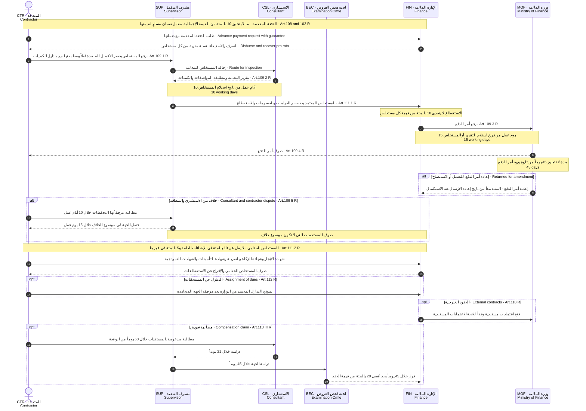

---

## 9. المرحلة 6 · الاستلام والضمان والتقييم | Phase 6 Detail

```mermaid
flowchart TB
    classDef act fill:#dce9f5,stroke:#2e6da4,color:#12283d
    classDef doc fill:#eaf5ea,stroke:#3f7d3f,color:#1d3b1d
    classDef gate fill:#f7d9d9,stroke:#a63d3d,color:#3d1414
    classDef clock fill:#f0e6f7,stroke:#7d3f9c,color:#2e1440

    subgraph SP61["L5 · الاستلام الابتدائي | Preliminary handover · Art.127 R"]
        direction TB
        G611{"L8 · نوع العقد؟<br>Contract type?"}:::gate
        A611["L6 · إشعار المتعاقد بإنجاز الأعمال · CTR<br>Contractor's completion notice"]:::act
        D602A[/"L9 · D-602-01 إشعار الإنجاز<br>Completion notice"/]:::doc
        A612["L7 · تكوين لجنة للبدء في المعاينة والاستلام · HOA<br>Form the inspection and receipt committee"]:::act
        T611(("L8 · 15 يوماً من تاريخ ورود إشعار المتعاقد<br>15 days from the notice")):::clock
        A613["L7 · معاينة الأعمال وتحرير محضر الاستلام الابتدائي · RC<br>Inspect and issue the preliminary handover minutes"]:::act
        D602C[/"L9 · D-602-03 محضر الاستلام الابتدائي<br>Preliminary handover minutes"/]:::doc
        G612{"L8 · انتهت مدة العقد ولم يسلم المتعاقد الأعمال؟<br>Contract expired without delivery? · Art.127 1 R"}:::gate
        A614["L8 · تكوين لجنة فنية لمعاينة الأعمال وإعداد محضر بالاشتراك مع المتعاقد لحصر الأعمال المنجزة ونسبة الإنجاز وتحديد أسباب ومعوقات التأخير<br>Technical inspection minutes with completion percentage and delay causes"]:::act
        A615["L8 · تعذر الاستلام لأسباب لا علاقة للمتعاقد بها · محضر معاينة بمشاركة المتعاقد أو ممثله لحصر كافة الأعمال المنجزة<br>Inspection minutes where the impediment is entity-side"]:::act
        A616["L6 · استلام عقود الخدمات ذات التنفيذ المستمر قبل انتهاء مدة العقد بثلاثين يوماً بموجب محضر يوقعه المتعاقد أو ممثله · RC<br>Continuous services receipt 30 days before expiry · Art.129 1 R"]:::act
        A617["L6 · عقود التوريد · تسليم الأصناف للمستودعات وفحصها واستلامها مؤقتاً ثم نهائياً · RC<br>Supply contracts · warehouse delivery, inspection, provisional then final receipt · Art.130 R"]:::act
        G613{"L8 · رفضت لجنة الفحص صنفاً أو أكثر؟<br>Committee rejected any items? · Art.130 4 R"}:::gate
        A618["L8 · إبلاغ المورد بالأصناف المرفوضة وأسباب رفضها ووجوب سحبها وتوريد بديل خلال 7 أيام ولا تتحمل الجهة مسؤولية ما يحدث بعد انتهاء المدة<br>Notify, withdraw and replace within 7 days"]:::act
    end

    subgraph SP62["L5 · سنة الضمان والمسؤولية | Warranty and liability · Art.99 and 128 R"]
        direction TB
        A621["L6 · بقاء المشروع في ضمان المتعاقد مدة لا تقل عن سنة اعتباراً من تاريخ الاستلام الابتدائي وتبدأ مدة ضمان النواقص من تاريخ استلامها · SUP<br>One-year warranty from preliminary handover"]:::act
        T621(("L8 · سنة واحدة<br>One year")):::clock
        A622["L8 · التزام المتعاقد خلال سنة الضمان بصيانة وإصلاح واستبدال ما يظهر من عيوب في المواد أو الأجهزة أو المعدات أو عيوب في التنفيذ · CTR<br>Maintain, repair and replace defects"]:::act
        A623["L8 · عدم شمول الضمان أعمال الصيانة الدورية أو العادية الناتجة عن الاستخدام ما لم يرجع السبب إلى عيب في المواد أو التنفيذ<br>Routine wear excluded unless caused by a defect · Art.128 3 R"]:::act
        G621{"L8 · لم يلتزم المتعاقد بأعمال الضمان؟<br>Contractor failed to perform warranty works?"}:::gate
        A624["L8 · تنفيذ الأعمال على حسابه بما لا يتجاوز الأسعار السائدة بعد إنذاره بالطريقة التي تراها الجهة مناسبة<br>Execute at his expense after warning"]:::act
        A625["L8 · ضمان المتعاقد ما يحدث من تهدم كلي أو جزئي خلال عشر سنوات من تاريخ التسليم الابتدائي متى كان التهدم ناشئاً عن عيب في التنفيذ · LEG<br>Ten-year decennial liability · Art.99 1 R"]:::act
        T622(("L8 · عشر سنوات<br>Ten years")):::clock
        A626["L7 · ضمان المورد للسلع والأجهزة والمعدات والآليات من أي عيوب أو تلفيات إضافة إلى ضمان الشركات المصنعة · CTR<br>Supplier and manufacturer warranties · Art.99 2 R"]:::act
        A627["L7 · طلب تمديد سريان الضمان النهائي إذا تأخر المتعاقد في تنفيذ أعمال الصيانة والضمان · FIN<br>Extend the final guarantee on warranty delay · Art.101 R"]:::act
    end

    subgraph SP63["L5 · المستخلص الختامي والاستلام النهائي | Final certificate and final handover"]
        direction TB
        A631["L6 · تقديم شهادة إنجاز الأعمال من الجهة صاحبة المشروع وشهادة الزكاة والدخل وشهادة التأمينات الاجتماعية والشهادات الواجب تقديمها بموجب نماذج العقود · CTR و FIN<br>Assemble the final certificate document set · Art.111 2 R"]:::act
        D601[/"L9 · D-601-01 إلى D-601-05 حزمة المستخلص الختامي<br>Final certificate package"/]:::doc
        A632["L6 · الاستلام النهائي بعد انتهاء مدة الضمان والصيانة وتنفيذ المتعاقد التزاماته وتسليمه المخططات ومواصفات الأجهزة والمعدات والمستندات المتعلقة بالمشروع · RC<br>Final handover after warranty and full delivery · Art.128 4 R"]:::act
        D602L[/"L9 · D-602-12 محضر الاستلام النهائي والمخططات والمستندات<br>Final handover minutes and as-builts"/]:::doc
        A633["L7 · الإفراج عن الضمان النهائي · FIN<br>Release the final guarantee"]:::act
    end

    subgraph SP64["L5 · تقييم أداء المتعاقد | Contractor performance evaluation · Art.140 R"]
        direction TB
        A641["L6 · التقييم بحسب نوع العقد · دورياً في عقود التنفيذ المستمر ونهائياً بعد التنفيذ وفي التوريد الفوري بنهاية العقد وفي الاتفاقيات الإطارية لكل أمر شراء ولمجمل الأداء · PM<br>Evaluate by contract type"]:::act
        A642["L8 · الالتزام بمعايير التقييم الواردة في النموذج المعد من مركز تحقيق كفاءة الإنفاق<br>Use the EXPRO template and criteria · Art.140 3 R"]:::act
        A643["L7 · إبلاغ المتعاقد بنتيجة التقييم ورفعها إلى البوابة لتدوينها في سجله وتصبح نهائية بعد الإبلاغ ويتاح لبقية الجهات الاطلاع عليها · PM<br>Notify, record on the portal and share with other entities · Art.140 4 R"]:::act
        D603[/"L9 · D-603-01 إلى D-603-05 تقارير التقييم وإشعاراتها<br>Evaluation reports and notices"/]:::doc
        G641{{"L8 · تكرر حصول المتعاقد على درجة أقل من 70 بالمئة في مستوى الأداء لثلاثة عقود متتالية؟<br>Below 70 percent on three consecutive contracts? · Art.140 5 R"}}:::gate
        A644["L8 · الإحالة إلى اللجنة المنصوص عليها في المادة 88 من النظام للنظر في منع التعامل معه<br>Refer to the Art.88 L committee for debarment"]:::act
        A645["L8 · في عقود الخدمات ذات التنفيذ المستمر · إنهاء العقد عند حصول المتعاقد على أقل من 70 بالمئة لثلاث مرات متتالية وعدم إصلاحه لأوضاعه<br>Terminate on three consecutive sub-70 percent scores · Art.92 2 R"]:::act
    end

    CLOSED(["إغلاق العقد<br>Contract closed"])
    DEBAR(["لجنة النظر في منع التعامل · م 88 ن<br>Debarment committee"])

    G611 -->|"إنشاءات عامة · Public construction"| A611 --> D602A --> A612 --> T611 --> A613 --> D602C
    G611 -->|"خدمات مستمرة · Continuous services"| A616 --> A621
    G611 -->|"توريد · Supply"| A617 --> G613
    G613 -->|"نعم · Yes"| A618 --> A631
    G613 -->|"لا · No"| A631
    A613 --> G612
    G612 -->|"نعم · Yes"| A614 --> A621
    G612 -->|"تعذر لأسباب من الجهة · Entity-side impediment"| A615 --> A621
    G612 -->|"لا · No"| A621
    D602C --> A621 --> T621 --> A622 --> A623 --> G621
    G621 -->|"نعم · Yes"| A624 --> A625
    G621 -->|"لا · No"| A625
    A625 --> T622 --> A626 --> A627 --> A631
    A631 --> D601 --> A632 --> D602L --> A633 --> A641
    A641 --> A642 --> A643 --> D603 --> G641
    G641 -->|"نعم · Yes"| A644 --> DEBAR
    G641 -->|"لا · No"| A645 --> CLOSED
    A644 --> CLOSED
```

---

## 10. إنهاء العقد والسحب الجزئي | Termination and Partial Withdrawal · Art.131-139 R

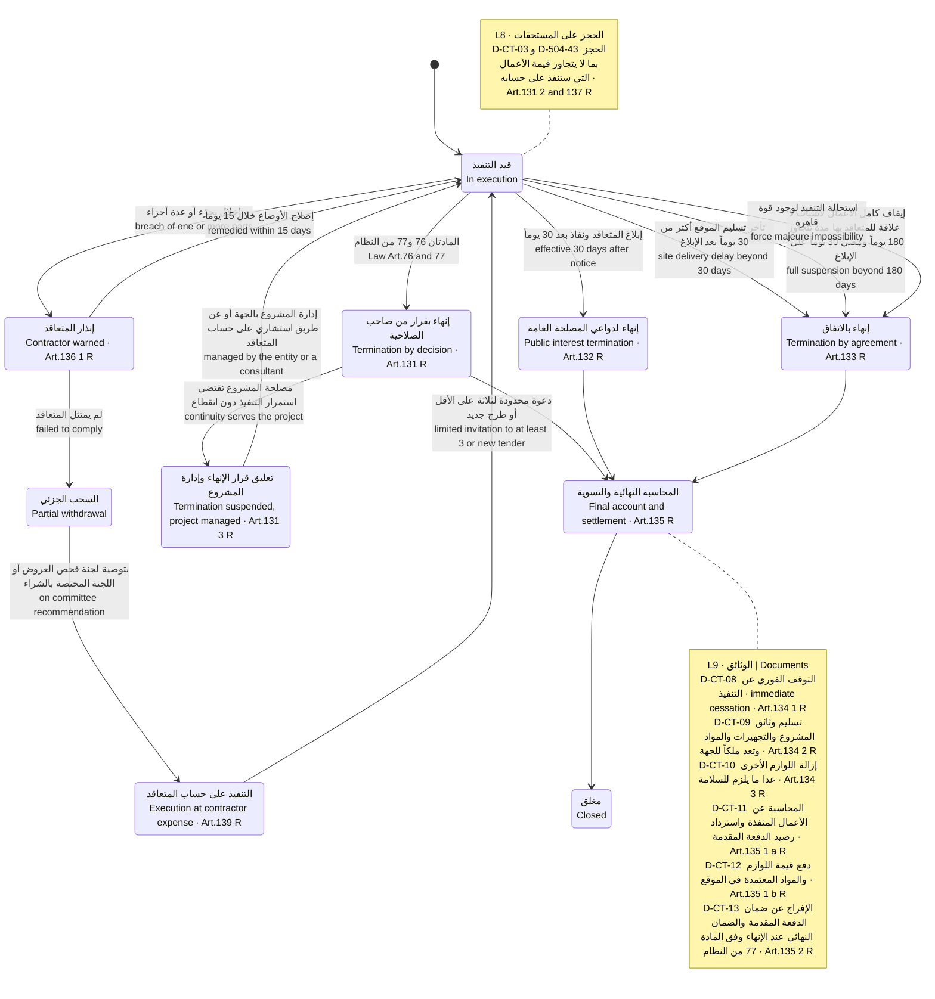

---

## 11. دورة حياة الضمانات | Guarantee Lifecycle · Art.70 and 100-107 R

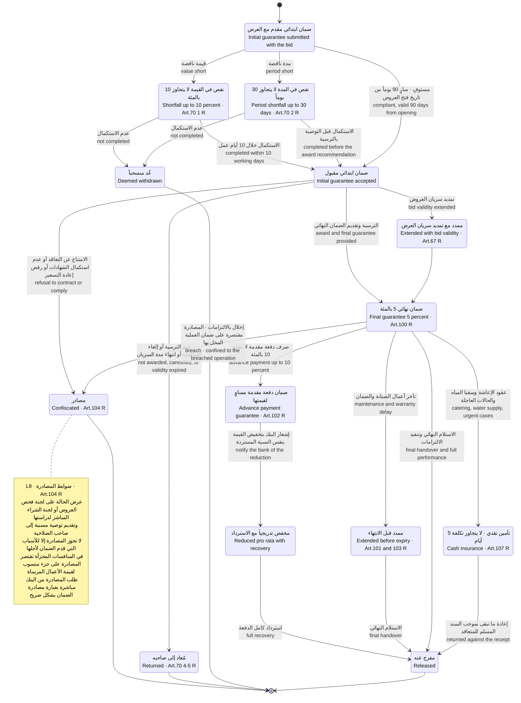

---

## 12. حل النزاعات | Dispute Resolution · Art.153-155 R

```mermaid
flowchart TB
    classDef act fill:#dce9f5,stroke:#2e6da4,color:#12283d
    classDef doc fill:#eaf5ea,stroke:#3f7d3f,color:#1d3b1d
    classDef gate fill:#f7d9d9,stroke:#a63d3d,color:#3d1414
    classDef clock fill:#f0e6f7,stroke:#7d3f9c,color:#2e1440

    N0["L5 · نزاع فني بين الجهة الحكومية والمتعاقد من شأنه أن يفضي إلى تعثر المشروع أو إلحاق الضرر بصاحب العمل أو بالمتعاقد أو بأي من مرافق الدولة<br>Technical dispute risking project failure or damage · Art.155 R"]:::act
    A1["L6 · حل النزاع بالطرق الودية · LEG<br>Amicable settlement"]:::act
    G1{"L8 · تم الحل ودياً؟<br>Resolved amicably?"}:::gate
    A2["L6 · تكوين مجلس حل النزاع · ممثل عن الجهة وممثل عن المتعاقد ورئيس تعينه وزارة المالية من القطاع الحكومي أو الخاص<br>Form the dispute council · Art.155 1 R"]:::act
    G2{{"L8 · يشترط في الرئيس والأعضاء أن يكونوا من ذوي الخبرة والكفاءة في المجال محل النزاع<br>Chair and members must be experienced in the field · Art.155 2 R"}}:::gate
    A3["L7 · تقديم كل طرف تقريراً فنياً عن الموضوع متضمناً وجهة نظره والمستندات المتعلقة وتقديم الاستشاري المشرف تقريره · Both parties and CSL<br>Technical reports from each party and the consultant · Art.155 3 R"]:::act
    D1[/"L9 · D-DS-03 و D-DS-04 التقارير الفنية والمستندات<br>Technical reports and documents"/]:::doc
    A4["L7 · تمكين المجلس من معاينة الأعمال على الطبيعة ودخول الموقع<br>Enable site inspection"]:::act
    G3{"L8 · حل النزاع يتطلب اللجوء إلى جهة خبرة؟<br>External expertise required? · Art.155 4 R"}:::gate
    A5["L7 · طلب الرأي والمشورة وتكون التكلفة مناصفة بين طرفي النزاع<br>Obtain expert advice, cost split equally"]:::act
    T1(("L8 · البت خلال 30 يوماً من تاريخ تسلمه التقرير والمستندات ذات العلاقة<br>Decide within 30 days")):::clock
    A6["L8 · إصدار القرار بالأغلبية وتوضيح الرأي المخالف إن وجد<br>Majority decision with the dissenting opinion stated · Art.155 6 R"]:::act
    D2[/"L9 · D-DS-07 قرار المجلس<br>Council decision"/]:::doc
    G4{"L8 · وافق طرفا النزاع على القرار؟<br>Both parties agreed?"}:::gate
    A7["L8 · يعد القرار نهائياً في موضوع الخلاف<br>The decision is final"]:::act
    A8["L8 · إعادة الاعتراض إلى المجلس موضحاً فيه الرأي محل الاعتراض والبت فيه خلال 15 يوماً ويعد القرار حينها واجب النفاذ<br>Objection returned, re-decided within 15 days, then binding"]:::act
    T2(("L8 · 15 يوماً<br>15 days")):::clock
    A9["L7 · للمتضرر الحق باللجوء إلى الجهة القضائية المختصة · المحكمة الإدارية<br>The aggrieved party may resort to the competent court"]:::act
    G5{{"L8 · يجب ألا يحول نظر أي نزاع بين الطرفين دون استمرار المتعاقد في تنفيذ التزاماته<br>No dispute suspends contractor performance · Art.155 8 R"}}:::gate
    G6{{"L8 · يقتصر فض النزاع من خلال المجلس على الخلافات الفنية دون ما عدا ذلك من مطالبات<br>Council jurisdiction is limited to technical disagreements · Art.155 9 R"}}:::gate
    A10["L7 · تحديد الوزارة مكافآت وأتعاب رئيس المجلس وممثلي الجهة وتدفع من قبلها<br>Ministry sets remuneration paid by the entity · Art.155 7 R"]:::act

    ARB["L6 · التحكيم · العقود التي تتجاوز قيمتها التقديرية 100 مليون ريال وموافقة الوزير وتطبيق أنظمة المملكة والنص عليه في وثائق العقد<br>Arbitration · Art.154 R"]:::act
    GRV["L6 · التظلم أمام اللجنة المنصوص عليها في المادة 86 من النظام مع تقديم الضمان<br>Grievance before the Art.86 L committee · Art.153 R"]:::act

    N0 --> A1 --> G1
    G1 -->|"نعم · Yes"| ENDD(["انتهاء النزاع<br>Dispute closed"])
    G1 -->|"لا · No"| A2 --> G2 --> A3 --> D1 --> A4 --> G3
    G3 -->|"نعم · Yes"| A5 --> T1
    G3 -->|"لا · No"| T1
    T1 --> A6 --> D2 --> G4
    G4 -->|"نعم · Yes"| A7 --> ENDD
    G4 -->|"لا · No"| A8 --> T2 --> A9 --> ENDD
    A6 --> G5
    A6 --> G6
    A2 --> A10
    N0 -.->|"نزاع تعاقدي غير فني<br>non-technical contractual dispute"| ARB
    N0 -.->|"مخالفة إجرائية<br>procedural violation"| GRV
```

---

## 13. بيع المنقولات والاستئجار والاستبدال | Disposal, Rental and Replacement · Art.141-152 R

```mermaid
flowchart TB
    classDef act fill:#dce9f5,stroke:#2e6da4,color:#12283d
    classDef doc fill:#eaf5ea,stroke:#3f7d3f,color:#1d3b1d
    classDef gate fill:#f7d9d9,stroke:#a63d3d,color:#3d1414
    classDef clock fill:#f0e6f7,stroke:#7d3f9c,color:#2e1440

    subgraph SPS["L5 · بيع المنقولات | Sale of movables · Art.141-149 R"]
        direction TB
        S1["L6 · تكوين لجنة لا يقل عدد أعضائها عن ثلاثة من المختصين لتقدير قيمة الأصناف والمنقولات المراد بيعها مراعية حالتها وكلفتها وعمرها الافتراضي وغير ذلك من العناصر المؤثرة · HOA<br>Form the valuation committee"]:::act
        G1S{"L8 · لا تتوافر لدى الجهة الخبرة الكافية؟<br>Insufficient in-house expertise?"}:::gate
        S2["L7 · الاستعانة بجهة تسعير ذات خبرة في مجال الأصناف المراد بيعها<br>Engage a specialised pricing body"]:::act
        S3["L8 · وضع الأسعار التقديرية في مظروف مختوم لا يفتح إلا من قبل رئيس لجنة البيع في حضور أعضائها بعد فتح مظاريف المزايدة أو انتهاء المزاد العلني<br>Sealed estimate opened only after bidding closes · Art.142 R"]:::act
        DS1[/"L9 · D-SM-03 مظروف الأسعار التقديرية المختوم<br>Sealed estimate envelope"/]:::doc
        S4["L6 · تكوين لجنة لا يقل عدد أعضائها عن ثلاثة لإجراء المزايدة العلنية وفتح مظاريف وفحص عروض الأصناف المراد بيعها بواسطة الظروف المختومة · HOA<br>Form the sale and auction committee · Art.143 1 R"]:::act
        S5["L7 · التأكد من سلامة المظاريف ووثائق المزايدة والضمانات المقدمة ومراجعة أسعار العروض وإعلانها على الحاضرين من أصحاب العروض أو ممثليهم<br>Verify envelopes, documents and guarantees · Art.143 2 R"]:::act
        S6["L7 · استكمال إجراءات المزايدة وتحديد أفضل العروض المطابقة لشروط المزايدة ورفع المحضر إلى صاحب الصلاحية لاعتماد الترسية<br>Determine the best offer and submit for award · Art.143 3 R"]:::act
        DS2[/"L9 · D-SM-06 محضر المزايدة<br>Auction minutes"/]:::doc
        G2S{{"L8 · انخفضت أسعار المزايدة عن الأسعار التقديرية بنسبة تزيد على 10 بالمئة؟<br>Bids more than 10 percent below the estimate? · Art.144 R"}}:::gate
        S7["L8 · الإعلان عنها مرة أخرى بعد إعادة تقديرها فإذا لم يتم الحصول على سعر مناسب جاز بيعها أو منحها وفقاً للمادة 83 من النظام<br>Re-value and re-advertise, then sell or grant"]:::act
        G3S{"L8 · أصناف أو منقولات مما يتلف سريعاً بالتخزين؟<br>Items perishable in storage? · Art.145 R"}:::gate
        S8["L8 · بيعها وفقاً لأحكام المادة 81 من النظام<br>Sell under Law Art.81"]:::act
        T1S(("L8 · البت في الترسية خلال 30 يوماً من تاريخ فتح مظاريف المزايدة أو انتهاء المزايدة العلنية<br>Award within 30 days · Art.146 R")):::clock
        S9["L8 · مضي المدة دون البت · للمزايد الرجوع في عرضه واسترداد ضمانه بموجب خطاب يقدمه للجهة خلال 10 أيام ويعد موافقاً على استمرار عرضه كل من لم يتقدم بخطابه خلال هذه المدة<br>Bidder may withdraw within 10 days"]:::act
        S10["L8 · زيادة ضمان من ترسو عليه المزايدة إلى 5 بالمئة من قيمة عرضه ويمهل مدة لا تزيد على 10 أيام من تاريخ إبلاغه بالترسية ليدفع كامل قيمة المنقولات وتكاليف نقلها وينذر كتابة في حال تأخره · Art.147 R<br>Increase guarantee to 5 percent and pay within 10 days"]:::act
        T2S(("L8 · 15 يوماً من تاريخ إنذاره وإلا يصادر ضمانه<br>15 days from the warning or the guarantee is confiscated")):::clock
        S11["L8 · التفاوض مع أصحاب العروض الأخرى بالترتيب للوصول إلى سعر من رست عليه المزايدة وإلا يعاد طرحها من جديد<br>Negotiate with the next bidders in rank"]:::act
        S12["L8 · التزام المشتري بنقل ما اشتراه خلال مدة لا تزيد على 15 يوماً من تاريخ سداد قيمة الأصناف والمنقولات المباعة وينذر كتابة عند التأخر ولا يفرج عن الضمان حتى يتم نقلها مع جواز الرجوع عليه بأجرة التخزين · Art.148 R<br>Collect within 15 days"]:::act
        G4S{"L8 · الاستعانة بالوسطاء المرخص لهم لإجراء المزايدة العلنية؟<br>Use licensed intermediaries? · Art.149 R"}:::gate
        S13["L8 · عمولة يدفعها المشتري لا تتجاوز نسبتها 2.5 بالمئة من قيمة المبيعات ويتم اختيار الوسطاء وفقاً لأحكام النظام واللائحة<br>Commission not exceeding 2.5 percent"]:::act
    end

    subgraph SPR["L5 · الاستئجار | Rental · Art.150 R"]
        direction TB
        R1["L6 · التحقق من أن الاستئجار يحقق للجهة مصلحة تفوق المصلحة المتحققة من الشراء · PO<br>Verify rental interest exceeds purchase"]:::act
        R2["L7 · بناء تقدير الاحتياج إلى الاستئجار على تقرير فني تعده لجنة فنية متخصصة ويعتمد من صاحب الصلاحية في الترسية<br>Base the need on an approved technical report"]:::act
        R3["L8 · أن تكون الأجهزة أو اللوازم المستأجرة مؤمناً عليها من قبل المؤجر أو تحت ضمانه مدة الاستئجار مع التزامه بصيانتها في جميع الأحوال<br>Insured or guaranteed and maintained by the lessor"]:::act
        G1R{{"L8 · تناسب مدة الاستئجار مع التكلفة المعتمدة للعقد في الميزانية على ألا تتجاوز خمس سنوات<br>Term matched to budget and not exceeding 5 years"}}:::gate
        DR1[/"L9 · D-SM-12 ملف الاستئجار<br>Rental case file"/]:::doc
    end

    subgraph SPE["L5 · استبدال الأجهزة والمعدات | Equipment replacement · Art.151-152 R"]
        direction TB
        E1["L6 · انتهاء العمر الافتراضي للأجهزة أو كونها ذات صفة التحديث والتطوير المستمر أو لا تلبي احتياج الجهة أو ارتفاع تكلفة الصيانة وقطع الغيار مقارنة بتكلفة الأجهزة الجديدة · BEN<br>Establish the replacement trigger"]:::act
        E2["L8 · أن يحقق الاستبدال وفراً للخزانة العامة أفضل من البيع<br>Replacement must yield better value than sale"]:::act
        E3["L7 · تشكيل لجنة فنية لمعاينة الأجهزة القديمة وإعداد تقرير فني يحدد تاريخ شرائها وكلفتها المؤمنة بها وحالتها الراهنة وقيمتها التقديرية وتوضح تحقق الضوابط<br>Technical committee inspection and report"]:::act
        E4["L8 · تضمين شروط ومواصفات الأجهزة الجديدة المطروحة للتنافس القيمة التقديرية للأجهزة القديمة ويكون التنافس في قيمة الأجهزة الجديدة<br>Competition is on the new equipment value"]:::act
        E5["L8 · خصم إجمالي تكلفة الأصل الجديد من الاعتماد المخصص وقيد قيمة الأصل القديم للإيرادات بمثابة مبيعات حكومية ويصرف للمورد فرق القيمة<br>Budget and revenue treatment"]:::act
        DE1[/"L9 · D-SM-13 ملف الاستبدال<br>Replacement case file"/]:::doc
        G1E{{"L8 · طرح احتياجات الاستئجار والاستبدال في منافسة عامة ويجوز تأمينها بالمنافسة المحدودة أو الشراء المباشر وفقاً لأحكام النظام واللائحة · Art.152 R"}}:::gate
    end

    S1 --> G1S
    G1S -->|"نعم · Yes"| S2 --> S3
    G1S -->|"لا · No"| S3
    S3 --> DS1 --> S4 --> S5 --> S6 --> DS2 --> G2S
    G2S -->|"نعم · Yes"| S7 --> G3S
    G2S -->|"لا · No"| G3S
    G3S -->|"نعم · Yes"| S8 --> T1S
    G3S -->|"لا · No"| T1S
    T1S --> S9 --> S10 --> T2S --> S11 --> S12 --> G4S
    G4S -->|"نعم · Yes"| S13
    R1 --> R2 --> R3 --> G1R --> DR1
    E1 --> E2 --> E3 --> E4 --> E5 --> DE1 --> G1E
```

---

## 14. مثال التحلل الكامل عبر المستويات العشرة | Worked 10-Level Decomposition

المثال يوضح كيف ينحدر الضابط النظامي من الأداة النظامية حتى حقل الإثبات الواحد في النظام الآلي.
This shows one statutory control descending from the legal instrument to a single evidence field in the system.

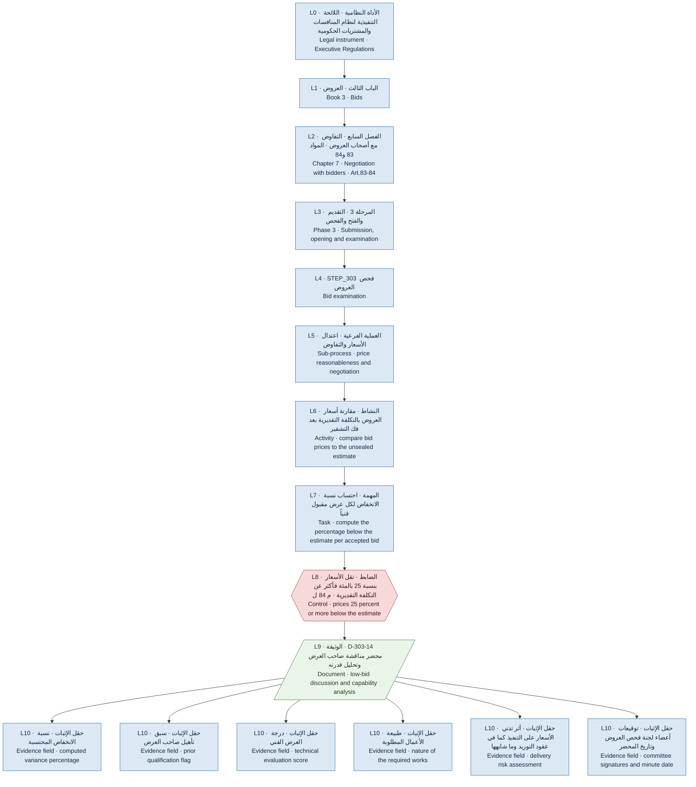

---

## 15. لوحة المدد النظامية | Statutory Clock Board

---

## ملاحظات التطبيق | Implementation Notes

1. **المخططات نموذج واحد.** المعرفات مثل `STEP_303` و `D-303-14` و `A353` مشتركة بين هذه الخريطة ووثيقة التصميم وسجل الوثائق، فأي تغيير نظامي يتتبع في المواضع الثلاثة.
   **The diagrams are one model.** Identifiers such as `STEP_303`, `D-303-14` and `A353` are shared across this atlas, the HLD and the document register, so a regulatory amendment is traceable in all three.

2. **البوابات المميزة بالشكل السداسي إلزامية.** كل بوابة تقابل قاعدة في محرك الالتزام مع رقم المادة وتاريخ النفاذ.
   **Hexagonal gates are mandatory.** Each maps to a `Compliance Rule` record carrying its article and effective date.

3. **المدد بأيام العمل تحتسب على التقويم السعودي.** لا يجوز احتساب المدد حسابياً دون الرجوع إلى تقويم أيام العمل والعطل الرسمية.
   **Working-day durations resolve against the Saudi working calendar**, never by naive date arithmetic.

4. **الملف المشفر للتكلفة التقديرية هو الضابط الأعلى خطورة.** إخفاقه يبطل المنافسة بنص المادة 27 فقرة 3 من اللائحة.
   **The sealed estimate is the highest-risk control**; its absence voids the tender under Art. 27(3).

5. **ما لم يرد في هذه الخريطة يخضع لأحكام المنافسة العامة.** المادة 41 من اللائحة تقضي بتطبيق أحكام المنافسة العامة على المنافسة المحدودة فيما لم يرد بشأنه نص خاص، والمادة 43 تقضي بذلك على المنافسة على مرحلتين.
   **Anything not shown here defaults to general competition rules** — Art. 41 for limited competition and Art. 43 for two-stage.
